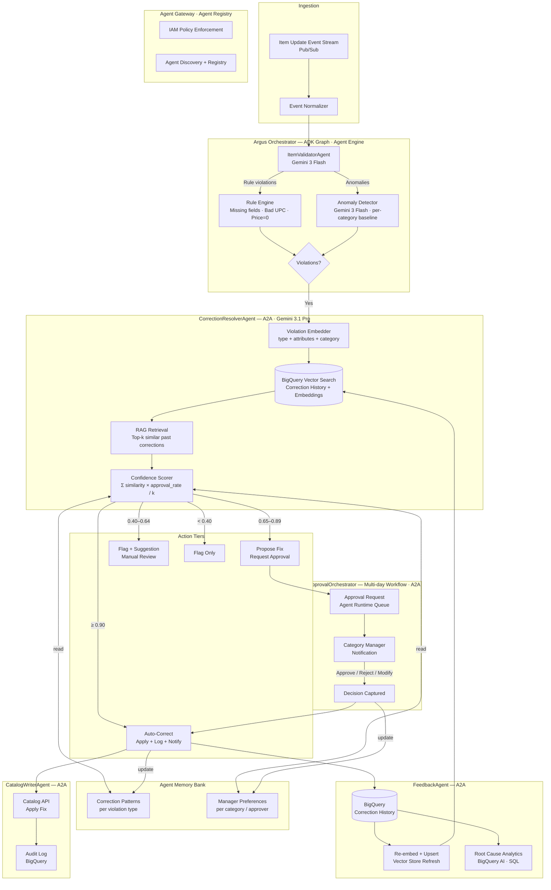

# Argus — Merchandising Catalog Intelligence Agent

> *Argus Panoptes: the all-seeing guardian. 100 eyes. Nothing escapes notice.*

Argus is an autonomous AI agent that detects invalid item setups in a grocery retailer's product catalog, proposes corrections using learned historical patterns, and applies fixes with category manager approval.

> Note: This is a fictional retail scenario for portfolio/educational use. Not affiliated with any specific retailer.

---

## Problem

A modern grocery retailer's product catalog receives continuous item updates from suppliers, internal teams, and automated feeds. Invalid item setups — missing fields, bad UPCs, price anomalies, taxonomy mismatches — cause downstream failures in search, pricing, fulfillment, and compliance. Manual review doesn't scale.

---

## Solution

An event-driven multi-agent system that:
1. Watches the item update stream
2. Validates each item via fast rules + Gemini-powered anomaly detection
3. Retrieves proven corrections via RAG natively in BigQuery
4. Auto-corrects high-confidence issues or routes to category managers via multi-day approval workflows
5. Feeds every decision back into its own knowledge base and memory

---

## Technology Foundation

Built on **Google's Gemini Enterprise Agent Platform** (Google Cloud Next 2026), leveraging:

| Capability | Google Service | Role in Argus |
|---|---|---|
| Multi-agent orchestration | ADK graph-based framework | Sub-agent coordination |
| Agent communication | A2A Protocol v1.0 | Inter-agent handoffs |
| Managed agent runtime | Agent Engine | Deployment + lifecycle |
| Vector search + RAG | BigQuery Vector Search (GA) | Single store: history + retrieval |
| LLM inference | Gemini 3 Flash / 3.1 Pro | Validation + reasoning |
| Long-term memory | Agent Memory Bank | Correction patterns + manager prefs |
| Governance | Agent Gateway + Agent Registry | IAM enforcement + discovery |
| Multi-day workflows | Agent Runtime | Approval requests span days natively |
| Analytics | BigQuery AI (BQML + SQL) | Root cause + scoring in SQL |

---

## High-Level Architecture



---

## Agent Design — ADK Graph with A2A

Sub-agents communicate via **A2A Protocol v1.0**, making Argus extensible to the retailer's broader agent ecosystem (supplier agents, pricing agents, etc.) without internal coupling.

| Sub-agent | Model | Responsibility |
|---|---|---|
| `ItemValidatorAgent` | Gemini 3 Flash | Rule engine + statistical anomaly detection |
| `CorrectionResolverAgent` | Gemini 3.1 Pro | RAG retrieval + reasoning on complex violations |
| `ApprovalOrchestrator` | Gemini 3 Flash | Approval workflow + multi-day lifecycle |
| `CatalogWriterAgent` | — | Apply fix + audit log |
| `FeedbackAgent` | — | Embed + upsert + memory update |

**Why two models:**
- **Gemini 3 Flash** for high-frequency, structured validation (fast, cheap, parallelizable)
- **Gemini 3.1 Pro** for complex cases requiring reasoning — e.g., taxonomy ambiguity, conflicting attributes, novel violation patterns

---

## Detection Layers

### Pass 1 — Rule Engine (deterministic, zero model cost)

| Rule | Violation Type |
|---|---|
| Required fields absent | `MISSING_FIELD` |
| UPC not 12-digit or fails check digit | `BAD_FORMAT` |
| Price ≤ 0 | `PRICE_ANOMALY` |
| Department/class/subclass blank | `MISSING_TAXONOMY` |
| Item ID collision | `DUPLICATE` |

Catches ~60% of issues instantly.

### Pass 2 — Gemini-Powered Anomaly Detection (per category baseline)

- **Numeric fields**: z-score against category distribution (price, weight, dimensions)
- **Categorical fields**: frequency check — flag if attribute value appears in <1% of category items
- **Taxonomy profile**: Gemini 3 Flash compares item attributes against learned category profile
- **Semantic anomaly**: item description vs. department/class misalignment (catches misrouted items)

---

## Resolution — RAG on BigQuery

BigQuery Vector Search (GA) eliminates a separate vector database. Correction history, embeddings, and retrieval all live in one system.

```
incoming violation
       ↓
embed(violation_type + relevant_item_attributes + category_context)
       ↓
BigQuery: VECTOR_SEARCH(corrections_table, query_embedding, top_k=10)
       ↓
confidence = Σ(similarity_i × approval_rate_i) / k
       ↓
CorrectionResolverAgent (Gemini 3.1 Pro) reasons over top-k results
       ↓
return: proposed_fix, confidence, supporting_examples[]
```

**BigQuery SQL pattern:**
```sql
SELECT
  base.correction_id,
  base.proposed_fix,
  base.approval_rate,
  distance
FROM VECTOR_SEARCH(
  TABLE argus.correction_history,
  'embedding',
  (SELECT embedding FROM argus.query_violations WHERE id = @violation_id),
  top_k => 10
)
```

### Action Tiers

| Confidence | Match Quality | Action |
|---|---|---|
| ≥ 0.90 | Exact / near-exact | Auto-correct → log → notify |
| 0.65 – 0.89 | Strong match | Propose fix → request approval |
| 0.40 – 0.64 | Weak match | Flag with suggestion → manual review |
| < 0.40 | No match | Flag only |

Thresholds configurable. Start conservative — loosen as history and approval rate grow.

---

## Agent Memory Bank

Google's Agent Memory Bank provides dynamically curated long-term memory with low-latency recall.

**Argus uses two memory profiles:**

| Profile | What it stores | Used by |
|---|---|---|
| `CorrectionPatterns` | Violation type → fix → confidence trajectory over time | `CorrectionResolverAgent` |
| `ManagerPreferences` | Per-approver: preferred fix style, auto-correct comfort per category | `ApprovalOrchestrator` |

Memory improves personalization: if a category manager consistently modifies proposed fixes in a specific direction, Argus learns and adjusts future proposals for that manager.

---

## Data Model — Correction Record

```json
{
  "correction_id": "uuid",
  "item_id": "retail_item_id",
  "event_timestamp": "ISO8601",
  "violation_type": "MISSING_FIELD | BAD_FORMAT | PRICE_ANOMALY | TAXONOMY_MISMATCH | DUPLICATE",
  "violation_details": {},
  "item_snapshot": {},
  "category_context": { "dept": "", "class": "", "subclass": "" },
  "embedding": "[float array — stored in BigQuery Vector column]",
  "proposed_fix": {},
  "fix_source": "RULE | RAG | MANUAL",
  "confidence_score": 0.0,
  "approver_id": "",
  "approval_status": "APPROVED | REJECTED | MODIFIED",
  "applied_fix": {},
  "applied_timestamp": "ISO8601",
  "approval_rate": 0.0
}
```

---

## Approval Workflow — Multi-day Native

Agent Engine's multi-day workflow support means approval requests survive agent restarts and span business days without timeout hacks or polling loops.

```
violation flagged (confidence 0.65–0.89)
       ↓
ApprovalOrchestrator creates durable workflow in Agent Engine
       ↓
notification sent to category manager
       ↓
[agent pauses — resumes on webhook callback, no polling]
       ↓
manager approves / rejects / modifies (hours or days later)
       ↓
workflow resumes → FeedbackAgent → CatalogWriterAgent
```

---

## Feedback Loop

Every resolved correction improves future accuracy:

```
approval / rejection captured
       ↓
update correction_record in BigQuery
       ↓
re-embed if applied_fix ≠ proposed_fix (Gemini embedding API)
       ↓
upsert embedding → BigQuery Vector column
       ↓
update approval_rate for similar correction pattern
       ↓
update Agent Memory Bank: CorrectionPatterns + ManagerPreferences
```

High-volume violation types graduate to auto-correct over time as confidence builds.

---

## Root Cause Analytics — BigQuery AI

Powered by BigQuery AI (BQML + Gemini functions in SQL):

- Which supplier / source system generates the most violations?
- Which violation types are growing vs. shrinking week-over-week?
- Which categories have the lowest auto-correct rate? (signals rule tuning needed)
- Which items are repeat offenders?
- Gemini-generated natural language summaries of anomaly clusters

Daily digest surfaced to category managers. Upstream teams receive scorecards.

---

## POC Scope

| Production Component | POC Equivalent | Notes |
|---|---|---|
| Pub/Sub event stream | JSON file replayer | Replay synthetic item events |
| BigQuery Vector Search | **Use real BigQuery** (GA, no setup cost) | Worth wiring real — validates core RAG claim |
| Agent Engine deployment | Local ADK runner | Swap to Agent Engine for demo |
| Gemini 3 Flash / 3.1 Pro | Use real Gemini APIs | No substitute |
| Retailer Catalog API | Log diff to stdout | Stub write-back |
| Agent Memory Bank | In-process dict | Upgrade to real Memory Bank post-POC |
| Approval workflow | TBD (pending UX decision) | Multi-day workflow or CLI prompt |
| A2A protocol | ADK local agent graph | A2A wiring added when deploying to Agent Engine |

### POC Success Criteria

- [ ] End-to-end happy path: file event → detection → RAG → proposed fix → approval → audit log
- [ ] At least 3 violation types detected and resolved
- [ ] BigQuery Vector Search retrieves meaningful similar corrections from synthetic history
- [ ] Confidence scoring differentiates auto-correct vs. escalate vs. flag-only
- [ ] Feedback loop updates BigQuery embeddings after approval
- [ ] Gemini 3.1 Pro reasoning visible on a complex / ambiguous violation

---

## Open Questions

1. **Demo happy path** — exact end-to-end flow TBD by stakeholder
2. **Approval UX** — CLI prompt? Email? Slack? Web page?
3. **Shared infra** — does Argus share GCP project / scaffolding with sibling agents in the workspace?
4. **Real history sample** — even 50 real correction records would validate RAG meaningfully vs. synthetic data
5. **A2A integration scope** — connect to other retailer agents (pricing, supplier) in v2?

---

## Related Decisions (ADRs)

These ADRs document the architectural choices made during POC implementation. They resolve the open questions above and record the rationale for each trade-off.

| ADR | Decision | Resolves |
|---|---|---|
| [ADR-0046](../../decisions/ADR-0046-argus-adk-multi-agent-orchestration.md) | Google ADK + AgentTool composition for orchestration | Framework selection |
| [ADR-0047](../../decisions/ADR-0047-argus-bigquery-vector-search-rag.md) | BigQuery Vector Search as unified RAG + audit store | Q4 — single store, no separate vector DB |
| [ADR-0048](../../decisions/ADR-0048-argus-three-tier-confidence-routing.md) | Three-tier routing: AUTO / PROPOSE / FLAG | Confidence threshold calibration |
| [ADR-0049](../../decisions/ADR-0049-argus-slack-human-in-the-loop-approval.md) | Slack Block Kit for human-in-the-loop approval | Q2 — approval UX |
| [ADR-0050](../../decisions/ADR-0050-argus-adk-tool-dependency-injection.md) | `_underscore` DI pattern for ADK tool testability | Test strategy, CI without GCP credentials |

---

## Governance

Via **Agent Gateway + Agent Registry** (Gemini Enterprise Agent Platform):

- Each Argus sub-agent gets a unique identity + IAM-scoped permissions
- Agent Gateway enforces least-privilege: `CatalogWriterAgent` is the only agent with catalog write permission
- All agent invocations logged for audit compliance
- Agent Registry enables discovery by other retailer agents via A2A

---

*Last updated: 2026-04-25 — reflects Google Cloud Next 2026 announcements*

---

## Sources

- [Google Cloud Next 2026: AI agents, A2A protocol](https://thenextweb.com/news/google-cloud-next-ai-agents-agentic-era)
- [Introducing Gemini Enterprise Agent Platform](https://cloud.google.com/blog/products/ai-machine-learning/introducing-gemini-enterprise-agent-platform)
- [A2A Protocol upgrade announcement](https://cloud.google.com/blog/products/ai-machine-learning/agent2agent-protocol-is-getting-an-upgrade)
- [BigQuery Vector Search is now GA](https://cloud.google.com/blog/products/data-analytics/bigquery-vector-search-is-now-ga)
- [What's new with ADK, Agent Engine, and A2A](https://developers.googleblog.com/en/agents-adk-agent-engine-a2a-enhancements-google-io/)
- [BigQuery AI platform](https://cloud.google.com/blog/products/data-analytics/gathering-advanced-data-agent-and-ml-tools-under-bigquery-ai)
