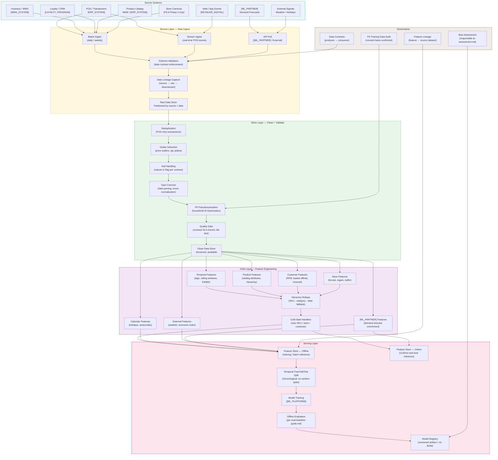

# Retail ML Preprocessing Pipeline — Architecture Design

**Status:** Template / Reference
**Owner:** AI Platform Team
**Last updated:** [DATE]
**Policy reference:** ADR-0045 — Retail ML Data Preprocessing Policy
**Related PRDs:** P0-A (AI Enablement Platform), P1-B (Replenishment), P3-A (Fresh), P2-A/P2-B (Shopping / Retail Media)

---

## Overview

This document defines the end-to-end data preprocessing pipeline for retail ML — from raw source systems to model-ready features in the feature store, and from the feature store to trained, versioned models in the registry.

The pipeline is organized in four layers: **Bronze** (raw ingest), **Silver** (clean + validate), **Gold** (features), and **Serving** (feature store + training). Each layer has explicit ownership, quality gates, and failure modes.

---

## Architecture Diagram



---

## Layer Specifications

### Bronze Layer — Raw Ingest

**Purpose:** Land raw data exactly as delivered; validate against contract; capture lineage.
**Rule:** Bronze is read-only and immutable. No transformations. The raw data is the audit record.

| Responsibility | Owner | Tool |
|---------------|-------|------|
| Schema validation against data contract | AI Platform Team | [CLOUD_PRIMARY] schema registry / Great Expectations |
| Partitioning by source × date | Data Platform Team | [CLOUD_PRIMARY] object storage |
| Lineage capture (source → raw) | Data Platform Team | [DATA_GOVERNANCE] lineage module |
| Failed batch notification | Data Platform Team | Alert → data producer on-call |

**Failure mode:** If schema validation fails, the batch is rejected. The raw store is NOT written. The data producer's on-call is paged. The ML consumer's pipeline is halted — stale data is preferable to schema-violated data.

**Ingest patterns by dataset:**

| Dataset | Pattern | Latency Target |
|---------|---------|---------------|
| DS-01 POS | Stream (real-time per transaction) + daily reconciliation batch | Real-time + daily |
| DS-02 Loyalty | Daily batch from loyalty platform | ≤ 24 hours |
| DS-03 Product Catalog | Daily batch (or event-driven on MDM change) | ≤ 24 hours |
| DS-04 Inventory | Hourly batch from WMS | ≤ 1 hour |
| DS-11 [ML_PARTNER] | API pull per delivery schedule | Per [ML_PARTNER] SLA |
| DS-07 Web/App | Real-time event stream | ≤ 5 minutes |
| DS-10 External | Daily batch from weather / economic APIs | ≤ 24 hours |

---

### Silver Layer — Clean + Validate

**Purpose:** Transform raw data into a clean, validated, PII-safe dataset ready for feature engineering.
**Rule:** Silver is the source of truth for all downstream feature engineering. Every transformation must be logged and reproducible.

#### Deduplication
- **POS transactions:** Deduplicate on (transaction_id, store_id, timestamp). Retain first occurrence. Log dedup rate — alert if > [X]%.
- **Loyalty profiles:** Deduplicate on household_id. Merge conflicts resolved per data contract merge strategy.
- **Inventory snapshots:** Dedup on (sku, store_id, snapshot_timestamp). Retain latest per (sku, store_id) per day.

#### Outlier Detection
Apply per dataset; document thresholds in data contract.

| Dataset | Outlier Check | Threshold | Action |
|---------|--------------|-----------|--------|
| POS | Unit price | < $0 or > P99.9 of category price | Clip and log |
| POS | Quantity sold | > P99.9 of item × store daily qty | Cap and log |
| Inventory | On-hand quantity | < −[X] (negative beyond allowance) | Clip to 0; log |
| Markdown | Markdown % | < 0 or > 100 | Reject row; log |
| Customer | Spend in single transaction | > P99.9 of customer's historical AOV × [N] | Flag for fraud review; retain |

#### Null Handling

| Strategy | When to Apply | Action |
|----------|--------------|--------|
| Reject row | NULL in primary key or label field | Drop row; log count |
| Forward-fill | Time-series fields with sparse NULLs (e.g., inventory snapshot) | Fill from previous record; log |
| Category median | Numerical attributes with < [X]% null rate | Impute with category-level median; add binary `_was_null` flag |
| Drop feature | NULL rate > [X]% for a feature | Drop feature from this training run; alert feature owner |
| Explicit placeholder | Categorical attributes | Fill with "UNKNOWN" sentinel; model handles as category |

#### PII Pseudonymization

Applies before any data leaves the Silver layer and enters feature engineering or training pipelines.

| Dataset | PII Fields | Pseudonymization Method |
|---------|-----------|------------------------|
| DS-02 Loyalty | name, email, phone, address | Replace with tokenized household_id (stable, reversible only by authorized system) |
| DS-01 POS | If joined to loyalty: household_id only (already tokenized) | household_id token passes through |
| DS-07 Web/App | session_id, device_id, IP address | Hash + salt; session-scoped only; no cross-session linkage in training data |

> [RISK: HIGH] household_id tokens from the loyalty platform must be verified as non-reversible outside the authorized lookup service before being used in training data. Confirm with privacy team.

#### Quality Gate (Silver exit)

Training data exits Silver only if all of the following pass:

- [ ] Null rate ≤ threshold per data contract for all required fields
- [ ] Dedup rate within expected bounds (< contract-specified threshold)
- [ ] Temporal coverage complete (no gaps > [X] days in training window)
- [ ] PII pseudonymization confirmed applied (no raw PII fields in output)
- [ ] Row count within ± [X]% of expected

---

### Gold Layer — Feature Engineering

**Purpose:** Produce model-ready features from clean data. All features follow the naming convention and are registered in the feature store.

See `feature-engineering-playbook.md` for full per-use-case feature specifications.

**Key invariants enforced in this layer:**

1. **No future leakage** — all rolling window features use only data available at the feature computation timestamp. The feature pipeline is point-in-time correct.
2. **Hierarchy fallback logic** — when entity-level data is sparse, automatically roll up to category or store-format level. Log when fallback was applied.
3. **Cold-start handler** — new entities receive a designated cold-start feature vector (see playbook §Global Rules). Cold-start entities are flagged with `entity_is_new = 1` so the model can learn separate behavior.
4. **[ML_PARTNER] availability check** — if [ML_PARTNER] feed is unavailable, all `mlpartner_*` features are set to 0.0 and `mlpartner_signal_available = 0`. The model must be trained to handle this case.

---

### Serving Layer — Feature Store + Training

#### Feature Store

| Concern | Offline Store | Online Store |
|---------|--------------|--------------|
| Use case | Model training; batch inference | Real-time inference (associate copilot, shopping assistant) |
| Latency | N/A (batch) | ≤ 100ms p99 |
| Storage | [CLOUD_PRIMARY] object storage (Parquet / Delta) | [CLOUD_PRIMARY] managed key-value or vector store |
| Update frequency | Daily (or per pipeline run) | Near-real-time (POS event triggers customer feature update) |
| Feature coverage | All features | Subset: high-freshness features needed at inference time |

#### Temporal Train / Validation / Test Split

This is mandatory and non-negotiable. Implemented as a pipeline step, not a post-hoc decision.

```
Timeline:
──────────────────────────────────────────────────────────────────────────►
│               TRAINING DATA              │  GAP  │  VAL  │  GAP  │ TEST │
│          [T_start] → [T_train_end]       │  [G]  │ [val] │  [G]  │[tst] │
```

Parameters (fill per use case):

| Parameter | Demand Forecasting | Fresh Markdown | CLV / Segmentation | Fraud |
|-----------|:-----------------:|:--------------:|:------------------:|:-----:|
| Min training window | 52 weeks | 26 weeks | 24 months | 26 weeks |
| Validation gap | 7 days | 3 days | 14 days | 7 days |
| Validation window | 8 weeks | 4 weeks | 3 months | 4 weeks |
| Test gap | 7 days | 3 days | 14 days | 7 days |
| Test window | 8 weeks | 4 weeks | 3 months | 4 weeks |
| Seasonal events in test? | Required | Required | Required | Required |

#### Model Registry Entry

Every trained model must be committed to the model registry with:
- Model artifact (weights + serialized pipeline)
- Training data version (snapshot reference from feature store)
- Training cutoff date
- Temporal split parameters used
- Eval metrics (offline) at each threshold
- AI-BOM reference
- Model card (per `model-card-template.md`)
- Responsible AI assessment result (per `responsible-ai-assessment.md`)

---

## Pipeline Failure Modes and Handling

| Failure | Detection | Response | Escalation |
|---------|-----------|----------|-----------|
| Source data late (SLA breach) | Ingest monitor alerts | Use previous delivery; flag training run as stale | Alert data producer; halt training if staleness > [X] hours |
| Schema validation failure | Schema check at Bronze | Reject batch; do not write to raw store | Alert data producer on-call + AI Platform |
| Quality gate failure at Silver | Row count / null / dedup check | Halt pipeline; do not proceed to Gold | Alert data platform + AI Platform Lead |
| [ML_PARTNER] feed unavailable | Availability check in Gold | Set mlpartner features to fallback values | Log incident; do not halt training |
| Feature leakage detected (audit) | Temporal audit in serving | Halt training; invalidate affected features | Alert AI Platform Lead; schedule feature pipeline review |
| Model eval below threshold | Eval gate in serving | Do not register model | Alert AI/ML team; investigate data quality or feature drift |

---

## Pipeline Orchestration

Implement the preprocessing pipeline as a directed acyclic graph (DAG) using the workspace's standard orchestration tool (see ADR-0039 — OSS MLOps Workflow Orchestration).

**Pipeline cadences:**

| Pipeline | Cadence | Trigger |
|----------|---------|---------|
| Demand forecasting feature pipeline | Daily | Cron: 02:00 UTC after POS batch lands |
| Fresh markdown feature pipeline | Hourly | Cron: every hour during store hours |
| Customer / CLV feature pipeline | Daily | Cron: 03:00 UTC after loyalty batch lands |
| Retail media audience feature pipeline | Daily | Cron: 04:00 UTC |
| Model retraining — demand | Weekly | Cron: Sunday 06:00 UTC |
| Model retraining — markdown | Weekly | Cron: Saturday 06:00 UTC |
| Model retraining — segmentation | Monthly | First Sunday of month |

**Retraining trigger conditions (in addition to calendar cadence):**
- Data drift alert: feature distribution shift detected (KS test p < [threshold])
- Model performance degradation: production metric (MAPE, acceptance rate) falls below configured threshold
- Any upstream data contract amendment

---

## Monitoring

| Monitor | Metric | Alert Threshold |
|---------|--------|----------------|
| Bronze ingest completeness | % of expected rows received | < [X]% → page data producer |
| Silver null rate | Null rate per required field | > contract threshold → halt |
| Silver dedup rate | % duplicates removed | > [X]% → alert (indicates upstream issue) |
| Gold feature coverage | % of feature store records with no nulls | < [X]% → alert |
| Feature freshness | Hours since last successful feature update | > [X] hours → alert on-call |
| Training data size | Row count vs. expected per use case | < [X]% of expected → halt training |
| Model eval gate | Offline eval metric vs. threshold | Below threshold → block registry |

Use [OBSERVABILITY] platform (per ADR-0029 for GCP / ADR-0019 for AWS / ADR-0009 for Azure) for pipeline observability. Every pipeline step emits traces and logs. Every feature store write is tracked in data lineage.

---

## Related Artifacts

- [`use-case-dataset-matrix.md`](use-case-dataset-matrix.md) — dataset inputs per use case
- [`data-catalog-template.md`](data-catalog-template.md) — dataset quality assessment
- [`data-contract-template.md`](data-contract-template.md) — producer ↔ consumer interface
- [`feature-engineering-playbook.md`](feature-engineering-playbook.md) — feature design per use case
- [`ADR-0045`](../../../decisions/ADR-0045-retail-ml-data-preprocessing-policy.md) — governing policy
- [`eval-baseline-guide.md`](../platform-enablement/eval-baseline-guide.md) — offline evaluation standards
- [`model-card-template.md`](../platform-enablement/model-card-template.md) — model card for registry
- [`pii-handling-checklist.md`](../platform-enablement/pii-handling-checklist.md) — PII policy (inference)
