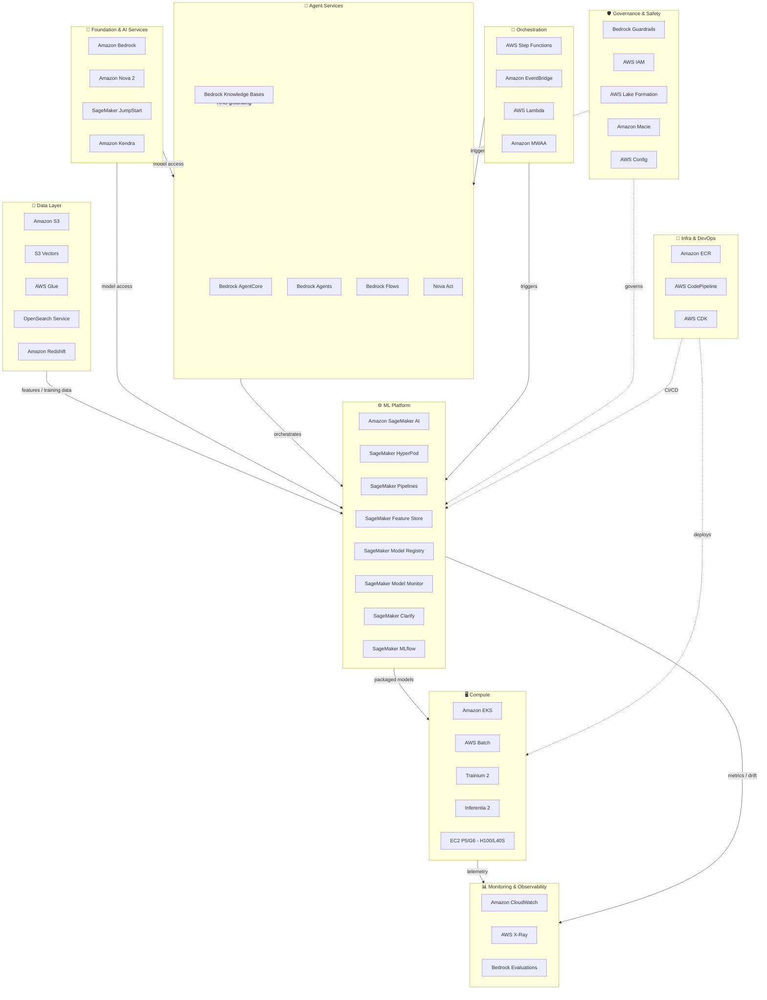

# AWS-Native AI Tech Stack — AIEnablement & MLOps Cheat Sheet

> **Audience:** AI Architects, MLOps Engineers, AI Enablement Leads
> **Scope:** AWS 1st-party services + key AWS SDKs used in AIEnablement and MLOps code
> **Last updated:** 2026-04-17 — verified against AWS re:Invent 2025 and Feb 2026 release notes

---

## Architecture Overview

---

## 1. Foundation & AI Services

| Service | Purpose | Key MLOps / AIEnablement Use | Docs |
|---|---|---|---|
| **Amazon Bedrock** | Managed access to foundation models — Amazon Nova, Claude, Llama, Mistral, Titan, Cohere, Stable Diffusion — with enterprise security | LLM inference, embeddings, fine-tuning, RAG; Reserved/Priority/Flex service tiers for cost/latency control | [docs](https://docs.aws.amazon.com/bedrock/) |
| **Amazon Nova 2** | Amazon's own model family — Lite, Pro (1M context, extended thinking), Sonic (speech-to-speech), Omni (multimodal I/O) | Cost-optimised inference with native AWS integration; Nova Forge for custom frontier models ($100K/yr) | [docs](https://docs.aws.amazon.com/nova/) |
| **Amazon Nova Act** *(GA)* | Browser automation agent — 90%+ task reliability, deploys to AgentCore with zero infra config | Automate web-based workflows in agentic pipelines; integrates natively with AgentCore Runtime | [docs](https://docs.aws.amazon.com/nova/) |
| **SageMaker JumpStart** | Model hub — pre-trained foundation models, fine-tuning templates, one-click deployment | Discover and deploy open models (Llama, Falcon, etc.); starting point for model evaluation and PoC | [docs](https://docs.aws.amazon.com/sagemaker/latest/dg/studio-jumpstart.html) |
| **Amazon Kendra** | Managed enterprise search with ML-powered relevance ranking | Enterprise RAG — index internal documents, SharePoint, S3 with intelligent retrieval | [docs](https://docs.aws.amazon.com/kendra/) |

---

## 2. Agent Services

| Service | Purpose | Key MLOps / AIEnablement Use | Docs |
|---|---|---|---|
| **Amazon Bedrock AgentCore** *(GA)* | Production agent infrastructure — Cedar-based policy controls, episodic memory, continuous quality evaluations, bidirectional streaming | Deploy and govern production agents; enforce what agents can/cannot do before any tool call | [docs](https://docs.aws.amazon.com/bedrock/latest/userguide/agents.html) |
| **Amazon Bedrock Agents** | Build conversational agents with tool use, multi-step reasoning, and memory | RAG + action execution; connect agents to APIs, Lambda functions, and knowledge bases | [docs](https://docs.aws.amazon.com/bedrock/latest/userguide/agents.html) |
| **Amazon Bedrock Knowledge Bases** | Managed RAG — automatic chunking, embedding, vector storage, and retrieval | Ground agents in enterprise data without building custom RAG pipelines; supports S3, Confluence, SharePoint | [docs](https://docs.aws.amazon.com/bedrock/latest/userguide/knowledge-base.html) |
| **Amazon Bedrock Flows** | Visual no-code builder for agent workflows — chain prompts, tools, and conditions as DAGs | Build and iterate on agent logic without code; deploy flows as managed endpoints | [docs](https://docs.aws.amazon.com/bedrock/latest/userguide/flows.html) |
| **Amazon Bedrock Guardrails** *(GA)* | Content filtering — PII redaction, topic blocking, grounding checks, hallucination detection, code safety | Apply safety layers to all LLM I/O in a pipeline; Guardrails for Code extends to code comments and variables | [docs](https://docs.aws.amazon.com/bedrock/latest/userguide/guardrails.html) |

---

## 3. ML Platform

> ⚠️ **SageMaker AI** was rebranded from "Amazon SageMaker" at re:Invent 2024 — now the unified brand for all SageMaker services.

| Service | Purpose | Key MLOps / AIEnablement Use | Docs |
|---|---|---|---|
| **Amazon SageMaker AI** | Core MLOps platform — Unified Studio IDE, experiments, training, model registry, managed endpoints, batch transform | End-to-end ML lifecycle from data prep to production serving; PrivateLink support for VPC isolation | [docs](https://docs.aws.amazon.com/sagemaker/) |
| **SageMaker HyperPod** *(GA — enhanced)* | Managed distributed training cluster — checkpointless training (80%+ downtime reduction), elastic auto-scaling | Large-scale foundation model training and fine-tuning; self-healing clusters reduce ops burden | [docs](https://docs.aws.amazon.com/sagemaker/latest/dg/sagemaker-hyperpod.html) |
| **SageMaker Serverless Customization** *(GA)* | UI-driven fine-tuning — SFT, DPO, RLVR, RLAIF — without managing compute | Fine-tune Nova, Llama, DeepSeek in a few clicks; no capacity planning or instance management | [docs](https://docs.aws.amazon.com/sagemaker/latest/dg/jumpstart-fine-tune.html) |
| **SageMaker Pipelines** | Reusable MLOps workflow DAGs — data prep → train → evaluate → register → deploy | Automated retraining pipelines with CI/CD integration; YAML-based pipeline definitions | [docs](https://docs.aws.amazon.com/sagemaker/latest/dg/pipelines.html) |
| **SageMaker Feature Store** | Centralised online + offline feature storage with point-in-time correctness | Feature sharing across teams; consistent feature serving for training and inference | [docs](https://docs.aws.amazon.com/sagemaker/latest/dg/feature-store.html) |
| **SageMaker Model Registry** | Versioned model store with approval workflows and metadata | Govern model promotion from dev → staging → prod; track lineage per model version | [docs](https://docs.aws.amazon.com/sagemaker/latest/dg/model-registry.html) |
| **SageMaker Model Monitor** | Production model health — data drift, model drift, bias drift | Detect degradation post-deployment; auto-trigger retraining on threshold breach | [docs](https://docs.aws.amazon.com/sagemaker/latest/dg/model-monitor.html) |
| **SageMaker Clarify** | Bias detection, explainability, and feature attribution — pre/post-deployment | Responsible AI auditing; SHAP-based explanations for model decisions | [docs](https://docs.aws.amazon.com/sagemaker/latest/dg/clarify-model-explainability.html) |
| **SageMaker MLflow** *(Serverless GA)* | Managed MLflow 3.4 with AI tracing — 2-min instance creation, no infra management | Experiment tracking, run comparison, model versioning with zero ops overhead | [docs](https://docs.aws.amazon.com/sagemaker/latest/dg/mlflow.html) |
| **Reinforcement Fine-Tuning** *(Bedrock — GA)* | RLVR (rule-based) and RLAIF (AI-judge) fine-tuning — avg 66% accuracy gain over base models | Specialise foundation models on domain-specific tasks with automated reward evaluation | [docs](https://docs.aws.amazon.com/bedrock/latest/userguide/model-customization-rlhf.html) |

---

## 4. Data Layer

| Service | Purpose | Key MLOps / AIEnablement Use | Docs |
|---|---|---|---|
| **Amazon S3** | Object storage — unlimited scale, lifecycle policies, event triggers | Training datasets, model artifacts, checkpoint storage, feature snapshots | [docs](https://docs.aws.amazon.com/s3/) |
| **Amazon S3 Vectors** *(GA)* | Native vector storage in S3 — 2B vectors per index, ~100ms query latency, 14 regions | Cost-efficient vector store for RAG — no separate vector DB needed for many use cases | [docs](https://docs.aws.amazon.com/s3/latest/userguide/vectors.html) |
| **Amazon OpenSearch Service** | Managed search + vector search with k-NN and hybrid retrieval | RAG pipelines — chunk, embed, index, and retrieve at low latency; replaces Elasticsearch | [docs](https://docs.aws.amazon.com/opensearch-service/) |
| **AWS Glue** | Serverless ETL — data cataloguing, transformation, quality checks | Build training data pipelines; data cataloguing for feature discovery and governance | [docs](https://docs.aws.amazon.com/glue/) |
| **Amazon Redshift** | Cloud data warehouse with ML-native capabilities (Redshift ML via SageMaker) | Large-scale feature engineering; in-warehouse model training via SQL | [docs](https://docs.aws.amazon.com/redshift/) |
| **Amazon DynamoDB** | Serverless NoSQL — single-digit ms latency at any scale | Online feature serving, agent session state, low-latency metadata stores | [docs](https://docs.aws.amazon.com/dynamodb/) |

---

## 5. Compute

| Service | Purpose | Key MLOps / AIEnablement Use | Docs |
|---|---|---|---|
| **Amazon EKS** | Managed Kubernetes — production container orchestration | Scalable model serving, multi-model inference clusters, MLOps tooling deployments | [docs](https://docs.aws.amazon.com/eks/) |
| **AWS Trainium 2** | Amazon's custom ML training chip — optimised for large model training | Distributed training at lower cost than GPU alternatives; Neuron SDK for framework support | [docs](https://aws.amazon.com/machine-learning/trainium/) |
| **AWS Inferentia 2** | Amazon's custom inference chip — high throughput, low cost per token | Production inference for latency-sensitive LLM serving at scale | [docs](https://aws.amazon.com/machine-learning/inferentia/) |
| **EC2 P5 / G6 instances** | NVIDIA H100 (P5) and L40S (G6) GPU instances | Custom training and high-performance inference workloads requiring full GPU control | [docs](https://aws.amazon.com/ec2/instance-types/p5/) |
| **AWS Batch** | Managed batch compute — job queues, auto-scaling, spot integration | Large-scale batch inference, distributed training jobs, hyperparameter sweeps | [docs](https://docs.aws.amazon.com/batch/) |

---

## 6. Orchestration

| Service | Purpose | Key MLOps / AIEnablement Use | Docs |
|---|---|---|---|
| **AWS Step Functions** | Serverless workflow orchestration — visual state machines, error handling, parallel execution | MLOps pipelines outside SageMaker; multi-service AI workflows across Bedrock, Lambda, and data services | [docs](https://docs.aws.amazon.com/step-functions/) |
| **Amazon EventBridge** | Serverless event bus — route events between AWS services and SaaS | Trigger retraining on data arrival, alert on model drift events, chain AI pipeline stages | [docs](https://docs.aws.amazon.com/eventbridge/) |
| **AWS Lambda** | Serverless compute — event-driven, sub-second invocation | Lightweight inference endpoints, agent tool handlers, preprocessing transforms | [docs](https://docs.aws.amazon.com/lambda/) |
| **Amazon MWAA** | Managed Apache Airflow — complex DAG orchestration | Complex ML pipelines with external dependencies; teams already invested in Airflow | [docs](https://docs.aws.amazon.com/mwaa/) |

---

## 7. Monitoring & Observability

| Service | Purpose | Key MLOps / AIEnablement Use | Docs |
|---|---|---|---|
| **Amazon CloudWatch** | Platform-wide metrics, logs, alarms, dashboards | Endpoint SLA tracking, training job health, token usage metrics, cost alerts | [docs](https://docs.aws.amazon.com/cloudwatch/) |
| **AWS X-Ray** | Distributed tracing — request flow across services, latency analysis | Trace LLM app requests end-to-end across Lambda, Bedrock, and SageMaker endpoints | [docs](https://docs.aws.amazon.com/xray/) |
| **Amazon Bedrock Model Evaluation** | Automated and human evaluation of LLM outputs — quality, toxicity, accuracy | Run evals before deployment; continuous quality scoring via AgentCore evaluations | [docs](https://docs.aws.amazon.com/bedrock/latest/userguide/model-evaluation.html) |
| **SageMaker Model Monitor** | Production model health — data drift, prediction drift, bias drift | Post-deployment monitoring with automated alerts and retraining triggers | [docs](https://docs.aws.amazon.com/sagemaker/latest/dg/model-monitor.html) |

---

## 8. Governance & Safety

| Service | Purpose | Key MLOps / AIEnablement Use | Docs |
|---|---|---|---|
| **Bedrock AgentCore Policy Controls** *(GA)* | Cedar-based policy enforcement with natural language authoring — controls what agents can do before any tool call | Fine-grained agent governance; define allowlists of permitted actions per agent role | [docs](https://docs.aws.amazon.com/bedrock/latest/userguide/agents.html) |
| **AWS Lake Formation** | Data lake governance — fine-grained access control, data cataloguing, column/row-level security | Govern access to training data and feature stores; enforce data policies across ML teams | [docs](https://docs.aws.amazon.com/lake-formation/) |
| **Amazon Macie** | ML-powered PII detection and data security for S3 | Scan training datasets for sensitive data; flag PII before it enters model training | [docs](https://docs.aws.amazon.com/macie/) |
| **AWS IAM** | Identity and access management — roles, policies, service principals | Least-privilege access for ML workloads; role-based access to models, endpoints, and data | [docs](https://docs.aws.amazon.com/iam/) |
| **AWS Config** | Continuous compliance monitoring and resource configuration history | Enforce guardrails on ML infra (approved instance types, encryption, tagging) | [docs](https://docs.aws.amazon.com/config/) |
| **Amazon SageMaker Clarify** | Bias detection, fairness analysis, and model explainability | Responsible AI auditing pre/post-deployment; SHAP explanations for model decisions | [docs](https://docs.aws.amazon.com/sagemaker/latest/dg/clarify-model-explainability.html) |

---

## 9. Infra & DevOps

| Service | Purpose | Key MLOps / AIEnablement Use | Docs |
|---|---|---|---|
| **Amazon ECR** | Private Docker registry — container image storage and lifecycle management | Store training environment images, model serving containers, SageMaker custom containers | [docs](https://docs.aws.amazon.com/ecr/) |
| **AWS CodePipeline / CodeBuild** | Managed CI/CD — automated build, test, and deploy pipelines | MLOps pipelines — trigger SageMaker pipeline runs on code or data changes | [docs](https://docs.aws.amazon.com/codepipeline/) |
| **AWS CDK** | Infrastructure as code in Python/TypeScript — L2/L3 constructs for AWS services | Define and version ML infrastructure (endpoints, pipelines, IAM roles) as code | [docs](https://docs.aws.amazon.com/cdk/) |
| **AWS CloudFormation** | Declarative infrastructure as code — YAML/JSON templates | Deploy reproducible ML environments; stack-based infra lifecycle management | [docs](https://docs.aws.amazon.com/cloudformation/) |

---

## 10. SDKs & Developer Tools

### Model Access & Agents

| SDK | Languages | Purpose | Key Use | Status | Docs |
|---|---|---|---|---|---|
| **boto3** | Python | Primary AWS SDK — low-level client for all AWS services | Call Bedrock, SageMaker, S3, and all AWS AI services | **GA** | [docs](https://boto3.amazonaws.com/v1/documentation/api/latest/index.html) |
| **amazon-bedrock-runtime** | Python, Java, .NET, JS/TS | High-level Bedrock client — InvokeModel, Converse API, streaming | LLM inference, streaming responses, multi-turn conversations | **GA** | [docs](https://docs.aws.amazon.com/bedrock/latest/userguide/getting-started.html) |
| **amazon-bedrock-agent-runtime** | Python, Java, .NET, JS/TS | Invoke Bedrock Agents and Knowledge Bases programmatically | Run agents, retrieve from knowledge bases, manage agent sessions | **GA** | [docs](https://docs.aws.amazon.com/bedrock/latest/userguide/agents-lambda.html) |

### ML Platform

| SDK | Languages | Purpose | Key Use | Status | Docs |
|---|---|---|---|---|---|
| **sagemaker** (Python SDK) | Python | High-level SageMaker SDK — training, tuning, deployment, pipelines | Author training jobs, deploy endpoints, build and run SageMaker Pipelines | **GA** | [docs](https://sagemaker.readthedocs.io/) |
| **MLflow** *(via SageMaker serverless)* | Python | Experiment tracking, model registry, serving | Track runs, compare experiments, register models — serverless managed by AWS | **GA** | [docs](https://docs.aws.amazon.com/sagemaker/latest/dg/mlflow.html) |

### Infra & Auth

| SDK | Languages | Purpose | Key Use | Status | Docs |
|---|---|---|---|---|---|
| **AWS CDK** | Python, TypeScript | Infrastructure as code with high-level constructs | Define ML infra (endpoints, pipelines, IAM, VPC) as versioned code | **GA** | [docs](https://docs.aws.amazon.com/cdk/api/v2/) |
| **AWS Neuron SDK** | Python | Compile and optimise models for Trainium / Inferentia chips | Deploy cost-efficient inference on Inferentia 2; distributed training on Trainium 2 | **GA** | [docs](https://awsdocs-neuron.readthedocs-hosted.com/) |

---

## Quick Reference: Concern → Service Mapping

| Architectural Concern | Primary Services |
|---|---|
| LLM access & model selection | Amazon Bedrock, SageMaker JumpStart |
| Amazon's own models | Amazon Nova 2 (Lite/Pro/Sonic/Omni) |
| Agent building & orchestration | Bedrock AgentCore, Bedrock Agents, Bedrock Flows |
| Agent memory & state | Bedrock AgentCore (episodic memory) |
| Enterprise data grounding (RAG) | Bedrock Knowledge Bases, Amazon Kendra, OpenSearch |
| Vector store | Amazon S3 Vectors, Amazon OpenSearch |
| Training & experimentation | SageMaker AI, SageMaker HyperPod, EC2 P5/G6 |
| Custom silicon training | AWS Trainium 2 + Neuron SDK |
| Custom silicon inference | AWS Inferentia 2 + Neuron SDK |
| Fine-tuning (no-infra) | SageMaker Serverless Customization, Bedrock RFT |
| Feature management | SageMaker Feature Store |
| MLOps pipelines | SageMaker Pipelines, AWS Step Functions |
| Experiment tracking | SageMaker MLflow (serverless) |
| Model registry & promotion | SageMaker Model Registry |
| Model serving (online) | SageMaker Managed Endpoints, EKS |
| Model serving (batch) | SageMaker Batch Transform, AWS Batch |
| Data pipelines | AWS Glue, Amazon EventBridge, MWAA |
| Monitoring & drift detection | SageMaker Model Monitor, CloudWatch |
| LLM quality & safety evals | Bedrock Model Evaluation, AgentCore Evaluations |
| Content safety & guardrails | Amazon Bedrock Guardrails |
| Bias & explainability | SageMaker Clarify |
| Agent policy enforcement | Bedrock AgentCore Policy Controls (Cedar) |
| Data governance & PII | AWS Lake Formation, Amazon Macie |
| Identity & access | AWS IAM |
| CI/CD for ML | AWS CodePipeline, CodeBuild, GitHub Actions |
| Infra as code | AWS CDK, CloudFormation |
| **SDK: Model inference** | `boto3` + `amazon-bedrock-runtime` |
| **SDK: Agent invocation** | `amazon-bedrock-agent-runtime` |
| **SDK: ML pipelines & training** | `sagemaker` Python SDK |
| **SDK: Custom silicon** | AWS Neuron SDK |
| **SDK: Infra as code** | AWS CDK |
