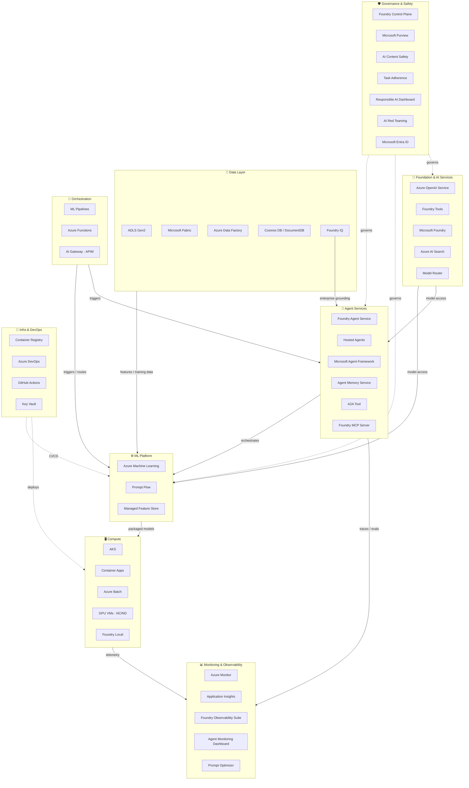

# Azure-Native AI Tech Stack — AIEnablement & MLOps Cheat Sheet

> **Audience:** AI Architects, MLOps Engineers, AI Enablement Leads
> **Scope:** Azure / Microsoft 1st-party services + key Microsoft SDKs used in AIEnablement and MLOps code
> **Last updated:** 2026-04-17 — verified against Microsoft Foundry April 2026 docs, Ignite 2025, and Dec 2025–Jan 2026 release notes
> ⚠️ **AzureML SDK v1 EOL: June 30, 2026** — migrate to `azure-ai-projects` v2
> ⚠️ **Prompt Flow SDK sunset** — migration to Microsoft Framework Workflows, window opens January 2027

---

## Architecture Overview

---

## 1. Foundation & AI Services

| Service | Purpose | Key MLOps / AIEnablement Use | Docs |
|---|---|---|---|
| **Azure OpenAI Service** | Managed access to OpenAI models — GPT-5.2, GPT-5.1 Codex Max, GPT-4o, o1, embeddings, DALL-E, Sora 2 | LLM inference, embeddings for RAG, fine-tuning, Reinforcement Fine-Tuning (GPT-5) | [docs](https://learn.microsoft.com/en-us/azure/ai-services/openai/) |
| **Microsoft Foundry** *(formerly Azure AI Foundry)* | Unified platform for building, governing, and scaling AI — model catalog, fine-tuning, evaluation, agent development, one-click deployment to M365/Teams | Central hub for the full AI lifecycle: discover models, fine-tune, evaluate, deploy agents and LLM apps | [docs](https://learn.microsoft.com/en-us/azure/foundry/) |
| **Foundry Tools** *(formerly Azure AI Services)* | Multi-modal AI capabilities — Vision, Speech, Language, Document Intelligence, Azure Content Understanding (GA), Live Interpreter (GA), LLM Speech (Preview) | Pre-built AI processing for documents, audio, video, images — no custom training required | [docs](https://learn.microsoft.com/en-us/azure/ai-services/) |
| **Azure AI Search** | Managed search with vector, semantic, and hybrid retrieval | RAG pipelines — chunking, indexing, and low-latency retrieval for LLM grounding | [docs](https://learn.microsoft.com/en-us/azure/search/) |
| **Model Router** *(GA)* | Automatic model selection based on prompt complexity and cost targets | Optimise token cost vs quality without manual routing logic — routes across OpenAI, Claude, Mistral, Phi | [docs](https://learn.microsoft.com/en-us/azure/ai-foundry/) |

---

## 2. Agent Services *(New category — Ignite 2025)*

| Service | Purpose | Key MLOps / AIEnablement Use | Docs |
|---|---|---|---|
| **Foundry Agent Service** *(GA)* | Managed multi-agent orchestration with persistent memory and enterprise governance | Production-grade agent hosting — run, monitor, and govern agents without managing infra | [docs](https://learn.microsoft.com/en-us/azure/ai-services/agents/) |
| **Hosted Agents** *(GA)* | Deploy custom-code agents (LangGraph, CrewAI, Microsoft Agent Framework) into a fully managed runtime | No containers, no Kubernetes — agents run in managed compute with built-in scaling | [docs](https://learn.microsoft.com/en-us/azure/foundry/agents/quickstarts/quickstart-hosted-agent) |
| **Microsoft Agent Framework** *(GA, open source)* | Unified SDK for building durable, interoperable multi-agent systems — merges Semantic Kernel + AutoGen | Build production agents with cross-cloud flexibility; supports rapid prototyping through to enterprise deployment | [docs](https://learn.microsoft.com/en-us/azure/ai-foundry/) |
| **Memory in Foundry Agent Service** *(Preview)* | Managed long-term memory store with automatic extraction, consolidation, and retrieval across agent sessions | Enable agents to retain user context and facts across conversations without custom vector stores | [docs](https://learn.microsoft.com/en-us/azure/foundry/agents/how-to/memory-usage) |
| **Agent-to-Agent (A2A) Tool** *(Preview)* | Lets Foundry agents call any A2A-protocol endpoint with explicit auth and clean call/response semantics | Multi-agent orchestration — delegate sub-tasks to specialist agents across frameworks or clouds | [docs](https://learn.microsoft.com/en-us/azure/foundry/agents/how-to/tools/agent-to-agent) |
| **Foundry MCP Server** *(Preview)* | Cloud-hosted Model Context Protocol server at `mcp.ai.azure.com` with Entra authentication | Give agents structured access to 1,400+ enterprise business system integrations via MCP | [docs](https://learn.microsoft.com/en-us/azure/foundry/mcp/available-tools) |
| **Foundry IQ** | Knowledge engine grounding agents in enterprise data — SharePoint, OneLake, ADLS Gen2, and web, governed by Purview | Single managed knowledge base for agent grounding — replaces ad-hoc RAG wiring | [docs](https://learn.microsoft.com/en-us/azure/foundry/) |

---

## 3. ML Platform

> ⚠️ **AzureML SDK v1 reaches EOL June 30, 2026.** Migrate to `azure-ai-projects` v2 (`2.0.0b3+`), which unifies agents, inference, evaluations, and memory.

| Service | Purpose | Key MLOps / AIEnablement Use | Docs |
|---|---|---|---|
| **Azure Machine Learning** | Core MLOps platform — experiments, training jobs, model registry, pipelines, managed online/batch endpoints | End-to-end ML lifecycle: track experiments, version models, automate retraining, serve predictions | [docs](https://learn.microsoft.com/en-us/azure/machine-learning/) |
| **Prompt Flow** | Visual LLM orchestration for building, evaluating, and deploying LLM-based flows (integrated into Microsoft Foundry) | CI/CD for LLM apps — define flows as DAGs, run evals, deploy as managed endpoints | [docs](https://learn.microsoft.com/en-us/azure/machine-learning/prompt-flow/) |
| **Managed Feature Store** | Centralised feature engineering and serving within Azure ML | Feature reuse across teams, point-in-time correct retrieval, online/offline serving | [docs](https://learn.microsoft.com/en-us/azure/machine-learning/concept-feature-store) |

---

## 4. Data Layer

| Service | Purpose | Key MLOps / AIEnablement Use | Docs |
|---|---|---|---|
| **ADLS Gen2** | Hierarchical namespace blob storage at exabyte scale | Training datasets, model artifacts, checkpoint storage, feature snapshots | [docs](https://learn.microsoft.com/en-us/azure/storage/blobs/data-lake-storage-introduction) |
| **Microsoft Fabric** | Unified analytics platform — Lakehouse, Spark, Data Warehouse, Real-Time Intelligence | Large-scale data prep, feature engineering, streaming data for model inputs; Fabric data agent (Preview) for agent grounding | [docs](https://learn.microsoft.com/en-us/fabric/) |
| **Azure Data Factory** | Cloud ETL/ELT — managed data integration pipelines | Ingesting and transforming raw data into training-ready datasets | [docs](https://learn.microsoft.com/en-us/azure/data-factory/) |
| **Azure Cosmos DB** | Multi-model NoSQL with native vector search (DiskANN) | Vector store for RAG — store and retrieve embeddings at low latency | [docs](https://learn.microsoft.com/en-us/azure/cosmos-db/) |
| **Azure DocumentDB** *(GA — Ignite 2025)* | Fully managed NoSQL built on open-source tech; supports vector embeddings and hybrid/multicloud deployment | Alternative to Cosmos DB for teams needing open-source compatibility with enterprise vector search | [docs](https://learn.microsoft.com/en-us/azure/documentdb/) |

---

## 5. Compute

| Service | Purpose | Key MLOps / AIEnablement Use | Docs |
|---|---|---|---|
| **Azure Kubernetes Service (AKS)** | Managed Kubernetes — production-grade container orchestration | Scalable model serving, canary deployments, multi-model inference clusters | [docs](https://learn.microsoft.com/en-us/azure/aks/) |
| **Azure Container Apps** | Serverless container platform with autoscaling to zero | Low-ops inference APIs, event-driven scaling, sidecar-based model serving | [docs](https://learn.microsoft.com/en-us/azure/container-apps/) |
| **Azure Batch** | Managed large-scale parallel and distributed compute | Distributed training jobs, large-scale batch inference, hyperparameter sweeps | [docs](https://learn.microsoft.com/en-us/azure/batch/) |
| **GPU VMs (NC/ND-series)** | Bare-metal GPU compute — A100, H100, V100 SKUs | Custom training workloads requiring full GPU control (PyTorch, DeepSpeed) | [docs](https://learn.microsoft.com/en-us/azure/virtual-machines/sizes-gpu) |
| **Foundry Local** *(Preview)* | On-device AI execution — run Foundry models locally or at edge | Edge inference, offline scenarios, developer testing without cloud round-trips | [docs](https://learn.microsoft.com/en-us/azure/foundry-local/) |

---

## 6. Orchestration

| Service | Purpose | Key MLOps / AIEnablement Use | Docs |
|---|---|---|---|
| **Azure ML Pipelines** | Reusable ML workflow DAGs executed on Azure ML compute | Automated retraining — data prep → train → evaluate → register → deploy | [docs](https://learn.microsoft.com/en-us/azure/machine-learning/concept-ml-pipelines) |
| **Azure Functions** | Event-driven serverless compute | Lightweight inference triggers, model warmup, webhook handlers for ML events | [docs](https://learn.microsoft.com/en-us/azure/azure-functions/) |
| **AI Gateway** *(via Azure APIM — Preview)* | Model access management — rate limiting, routing, token quotas, usage analytics across all models in Foundry | Centralised governance and cost control for LLM API traffic across teams and environments | [docs](https://learn.microsoft.com/en-us/azure/api-management/ai-gateway-overview) |

---

## 7. Monitoring & Observability

| Service | Purpose | Key MLOps / AIEnablement Use | Docs |
|---|---|---|---|
| **Azure Monitor** | Platform-wide metrics, logs, alerts, dashboards | Infrastructure health for ML clusters, endpoint SLA tracking, cost alerts | [docs](https://learn.microsoft.com/en-us/azure/azure-monitor/) |
| **Application Insights** | APM — request tracing, dependency tracking, custom telemetry | Endpoint latency, error rates, token usage tracking for LLM APIs | [docs](https://learn.microsoft.com/en-us/azure/azure-monitor/app/app-insights-overview) |
| **Azure ML Model Monitoring** | Production model health — data drift, prediction drift, feature attribution | Detect model degradation post-deployment; trigger retraining on drift threshold breach | [docs](https://learn.microsoft.com/en-us/azure/machine-learning/concept-model-monitoring) |
| **Foundry Observability Suite** *(GA — Ignite 2025)* | End-to-end AI app observability — evaluations, synthetic datasets, tracing, quality/risk evaluators, AI Red Teaming agent | Full lifecycle quality assurance for LLM and agent workloads in a single pane | [docs](https://learn.microsoft.com/en-us/azure/foundry/observability/) |
| **Agent Monitoring Dashboard** *(GA)* | Purpose-built dashboard for tracking agent health, tool call success rates, latency, and memory usage | Monitor agent fleets in production — identify failed tool calls, hallucination patterns, cost per session | [docs](https://learn.microsoft.com/en-us/azure/foundry/observability/how-to/how-to-monitor-agents-dashboard) |
| **Prompt Optimizer** *(Preview)* | Automated prompt improvement using eval-driven feedback loops | Continuously improve system prompts against quality metrics without manual iteration | [docs](https://learn.microsoft.com/en-us/azure/foundry/observability/how-to/prompt-optimizer) |
| **Log Analytics Workspace** | Centralised log aggregation with KQL query interface | Cross-service log correlation, audit trails, custom MLOps dashboards | [docs](https://learn.microsoft.com/en-us/azure/azure-monitor/logs/log-analytics-workspace-overview) |

---

## 8. Governance & Safety

| Service | Purpose | Key MLOps / AIEnablement Use | Docs |
|---|---|---|---|
| **Foundry Control Plane** *(GA — Ignite 2025)* | Unified identity, monitoring, and compliance for agents — powered by Entra Agent ID | Manage agents across frameworks, clouds, and environments with a single governance layer | [docs](https://learn.microsoft.com/en-us/azure/foundry/control-plane/) |
| **Microsoft Purview** | Data governance — catalog, lineage, classification, sensitivity labels | Track training data lineage, classify PII in datasets, enforce data policies | [docs](https://learn.microsoft.com/en-us/purview/) |
| **Azure AI Content Safety** | Harm detection and content filtering for LLM inputs/outputs | Guardrails for generative AI apps — detect hate, violence, jailbreak attempts | [docs](https://learn.microsoft.com/en-us/azure/ai-services/content-safety/) |
| **Task Adherence** *(Preview — April 2026)* | Agentic guardrail that detects when an agent deviates from its assigned task or scope | Prevent agent scope creep and off-task behaviour in production multi-agent workflows | [docs](https://learn.microsoft.com/en-us/azure/foundry/guardrails/task-adherence) |
| **AI Red Teaming** *(via Foundry Observability Suite)* | Automated adversarial testing agent for LLM safety and robustness evaluation | Proactively identify safety failures, prompt injection vulnerabilities, and policy violations before deployment | [docs](https://learn.microsoft.com/en-us/azure/foundry/observability/) |
| **Responsible AI Dashboard** | Fairness, error analysis, interpretability, causal analysis (built into Azure ML) | Model auditing pre-deployment — understand behaviour across cohorts | [docs](https://learn.microsoft.com/en-us/azure/machine-learning/concept-responsible-ai-dashboard) |
| **Azure Policy** | Compliance guardrails enforced at resource level | Restrict GPU SKUs, enforce private endpoints, mandate tagging for cost allocation | [docs](https://learn.microsoft.com/en-us/azure/governance/policy/) |
| **Microsoft Entra ID** | Identity and access management — RBAC, service principals, managed identities, **Entra Agent ID** | Workload identity for ML compute, RBAC for model registry, SSO for Foundry; Agent ID governs agent actions | [docs](https://learn.microsoft.com/en-us/entra/identity/) |
| **Azure Key Vault** *(+ BYO Key Vault GA)* | Secrets, keys, and certificates management; BYO Key Vault for compliance-regulated deployments | Store API keys, connection strings, model signing keys; bring your own vault for regulated workloads | [docs](https://learn.microsoft.com/en-us/azure/key-vault/) |

---

## 9. Infra & DevOps

| Service | Purpose | Key MLOps / AIEnablement Use | Docs |
|---|---|---|---|
| **Azure Container Registry (ACR)** | Private Docker registry for container images | Store training environment images, model serving containers, base images | [docs](https://learn.microsoft.com/en-us/azure/container-registry/) |
| **Azure DevOps** | CI/CD pipelines, repos, boards, artifact feeds | MLOps pipelines — automated training, evaluation gates, model promotion workflows | [docs](https://learn.microsoft.com/en-us/azure/devops/) |
| **GitHub Actions** *(Azure-integrated)* | Git-native CI/CD with Azure ML and Foundry actions | Trigger retraining on data push, deploy agents on PR merge, run eval suites on schedule | [docs](https://learn.microsoft.com/en-us/azure/machine-learning/how-to-github-actions-machine-learning) |
| **Azure Cost Management** *(Tag-based AI attribution — GA)* | Cloud spend visibility with tag-based cost attribution and budget alerts | Track LLM token costs, training compute spend, and agent session costs per team/project | [docs](https://learn.microsoft.com/en-us/azure/cost-management-billing/) |

---

## 10. SDKs & Developer Tools

> These are the packages your team will `pip install` or `dotnet add`. Organised by concern.

### Agent & Orchestration

| SDK | Languages | Purpose | Key MLOps / AIEnablement Use | Status | Docs |
|---|---|---|---|---|---|
| **Microsoft Agent Framework** | Python, .NET | Production SDK for building durable multi-agent systems — merges Semantic Kernel + AutoGen into one unified API | Build, deploy, and orchestrate agents; integrates natively with Foundry Agent Service and Hosted Agents | **GA v1.0** (Apr 2026) | [docs](https://learn.microsoft.com/en-us/semantic-kernel/) |
| **Semantic Kernel** | Python, C#, Java | Lightweight AI orchestration middleware — plugins, planners, memory connectors, OpenAPI/MCP integration | Underlying layer of Microsoft Agent Framework; still valid for teams not yet on Agent Framework; plugin ecosystem is fully compatible | **GA v1.0+** | [docs](https://learn.microsoft.com/en-us/semantic-kernel/overview/) |

> **Guidance:** New projects → use **Microsoft Agent Framework** (superset of SK). Existing SK projects → compatible as-is; migrate to Agent Framework for multi-agent orchestration features.

---

### ML Platform & Pipelines

| SDK | Languages | Purpose | Key MLOps / AIEnablement Use | Status | Docs |
|---|---|---|---|---|---|
| **azure-ai-projects** v2 | Python, .NET, JS/TS | Unified Foundry SDK — agents, inference, evaluations, memory, tracing in one package | The primary SDK for all new Foundry development; replaces AzureML SDK v1 for most MLOps workflows | **v2 beta** (`2.0.0b3+`) | [docs](https://learn.microsoft.com/en-us/azure/ai-foundry/how-to/develop/sdk-overview) |
| **azure-ai-ml** (SDK v2) | Python | Azure ML SDK v2 — training jobs, pipelines, model registry, managed endpoints via Python/YAML | Author and run ML pipelines, register models, deploy endpoints; GitOps-friendly YAML serialisation | **GA** (replaces SDK v1, EOL Jun 2026) | [docs](https://learn.microsoft.com/en-us/azure/machine-learning/concept-v2) |
| **Prompt Flow SDK** | Python | Build and evaluate LLM flows as DAGs locally and in Azure ML | ⚠️ **Being sunset** — production use-cases migrating to Microsoft Framework Workflows. Migration window: January 2027 | **Sunset planned** | [docs](https://microsoft.github.io/promptflow/) |

---

### Inference & Model Access

| SDK | Languages | Purpose | Key MLOps / AIEnablement Use | Status | Docs |
|---|---|---|---|---|---|
| **azure-ai-inference** | Python, .NET, JS/TS | Lightweight, unified inference client — single API surface for all models in Foundry (OpenAI, Claude, Mistral, Phi, etc.) | Swap models without rewriting inference code; supports chat, embeddings, image generation via one SDK | **GA** | [docs](https://learn.microsoft.com/en-us/azure/ai-foundry/reference/reference-model-inference-api) |
| **openai** (Azure-flavoured) | Python, .NET, JS/TS | Official OpenAI SDK configured against Azure OpenAI Service endpoints | Direct GPT-4o / o1 / embeddings access with Azure auth; familiar API for teams coming from OpenAI | **GA** | [docs](https://learn.microsoft.com/en-us/azure/ai-services/openai/supported-languages) |

---

### Evaluation & Observability

| SDK | Languages | Purpose | Key MLOps / AIEnablement Use | Status | Docs |
|---|---|---|---|---|---|
| **azure-ai-evaluation** | Python | Run quality, safety, and performance evaluations against LLM outputs — local or cloud via Foundry | Integrate evals into CI/CD pipelines; compute groundedness, coherence, relevance, safety scores | **GA** | [docs](https://learn.microsoft.com/en-us/azure/ai-foundry/how-to/develop/evaluate-sdk) |
| **azure-monitor-opentelemetry** | Python, .NET, JS/TS | OpenTelemetry-based distro for Azure Monitor — auto-instruments traces, metrics, and logs | Instrument LLM apps and agents for end-to-end distributed tracing into Application Insights / Log Analytics | **GA** | [docs](https://learn.microsoft.com/en-us/azure/azure-monitor/app/opentelemetry-enable) |

---

### Data, Search & Safety

| SDK | Languages | Purpose | Key MLOps / AIEnablement Use | Status | Docs |
|---|---|---|---|---|---|
| **azure-search-documents** | Python, .NET, JS/TS | Azure AI Search client — index management, vector search, hybrid retrieval | Build and query RAG indexes; manage chunking pipelines, push embeddings, run semantic/hybrid queries | **GA** | [docs](https://learn.microsoft.com/en-us/azure/search/search-get-started-vector) |
| **azure-ai-contentsafety** | Python, .NET, JS/TS | Content Safety API client — harm detection, groundedness checks, prompt shield | Programmatically apply content filters and jailbreak detection in inference pipelines | **GA** | [docs](https://learn.microsoft.com/en-us/azure/ai-services/content-safety/quickstart-text) |
| **azure-identity** | Python, .NET, JS/TS | Azure authentication — managed identity, service principal, DefaultAzureCredential | Credential-free auth for all Azure AI SDKs in production; DefaultAzureCredential works locally and in cloud | **GA** | [docs](https://learn.microsoft.com/en-us/azure/developer/python/sdk/authentication-overview) |

---

### SDK Migration Cheat Sheet

| Old / Deprecated | Replace With | Deadline |
|---|---|---|
| `azureml-sdk` (v1) | `azure-ai-ml` (v2) + `azure-ai-projects` v2 | **Jun 30, 2026** |
| `azureml-core` | `azure-ai-ml` | **Jun 30, 2026** |
| Prompt Flow SDK | Microsoft Framework Workflows (via `azure-ai-projects`) | **Jan 2027** |
| AutoGen (standalone) | Microsoft Agent Framework | Now |
| Semantic Kernel (standalone agents) | Microsoft Agent Framework | Now (SK plugins still compatible) |

---

## Quick Reference: Concern → Service Mapping

| Architectural Concern | Primary Services |
|---|---|
| LLM access & model selection | Azure OpenAI Service, Microsoft Foundry, Model Router |
| Agent building & orchestration | Foundry Agent Service, Hosted Agents, Microsoft Agent Framework |
| Agent memory & state | Memory in Foundry Agent Service |
| Agent-to-agent communication | A2A Tool, Foundry MCP Server |
| Enterprise data grounding | Foundry IQ, Azure AI Search, Azure AI Search + ADLS Gen2 |
| Training & experimentation | Azure ML, Azure Batch, GPU VMs, Microsoft Fabric |
| Feature management | Azure ML Managed Feature Store, ADLS Gen2 |
| LLM app lifecycle (build → eval → ship) | Microsoft Foundry, Prompt Flow, Azure DevOps / GitHub Actions |
| Model serving (online) | Azure ML Managed Endpoints, AKS, Azure Container Apps |
| Model serving (batch) | Azure ML Batch Endpoints, Azure Batch |
| Edge / on-device inference | Foundry Local |
| Data pipelines | Azure Data Factory, Microsoft Fabric, ADLS Gen2 |
| Vector / RAG store | Azure AI Search, Azure Cosmos DB, Azure DocumentDB |
| LLM API governance & cost control | AI Gateway (APIM), Azure Cost Management, Model Router |
| Agent observability | Agent Monitoring Dashboard, Foundry Observability Suite, App Insights |
| Drift & model health | Azure ML Model Monitoring, Application Insights, Azure Monitor |
| LLM quality & safety evals | Foundry Observability Suite, Prompt Optimizer, AI Red Teaming |
| Agentic guardrails | Task Adherence, Azure AI Content Safety |
| Audit, lineage & data governance | Microsoft Purview, Azure ML Model Registry, Log Analytics |
| Agent identity & access governance | Foundry Control Plane, Microsoft Entra Agent ID |
| Secrets & credentials | Azure Key Vault (+ BYO Key Vault) |
| CI/CD for ML & agents | Azure DevOps, GitHub Actions, Azure Container Registry |
| **SDK: Build agents in code** | Microsoft Agent Framework, Semantic Kernel (plugins) |
| **SDK: Unified Foundry access** | `azure-ai-projects` v2 |
| **SDK: Traditional ML pipelines** | `azure-ai-ml` (SDK v2) |
| **SDK: Model inference (any model)** | `azure-ai-inference`, `openai` (Azure) |
| **SDK: LLM evals in CI/CD** | `azure-ai-evaluation` |
| **SDK: Distributed tracing / observability** | `azure-monitor-opentelemetry` |
| **SDK: RAG index & query** | `azure-search-documents` |
| **SDK: Content safety in pipelines** | `azure-ai-contentsafety` |
| **SDK: Auth (all Azure AI services)** | `azure-identity` (DefaultAzureCredential) |

---

## What's Changed Since Mid-2025

| Change | Impact |
|---|---|
| Azure AI Foundry → **Microsoft Foundry** | Rebrand; portal at `ai.azure.com` and `foundry.microsoft.com` |
| **AzureML SDK v1 EOL: June 30, 2026** | Migrate to `azure-ai-projects` v2 now |
| Foundry Agent Service GA | Production-ready managed agent infra — replaces DIY container deployments for agents |
| Microsoft Agent Framework GA | Replaces separate Semantic Kernel + AutoGen usage for enterprise agent builds |
| Foundry Control Plane + Entra Agent ID | Agent governance is now a first-class concern with dedicated identity layer |
| Model Router GA | Removes need for manual model routing logic in LLM apps |
| Azure DocumentDB GA | New NoSQL option alongside Cosmos DB with open-source parity |
| Task Adherence (Preview) | First native agentic scope guardrail on the platform |
| Foundry Observability Suite GA | Replaces fragmented evals setup — evals, tracing, red teaming in one place |
| **Microsoft Agent Framework 1.0 GA** (Apr 2026) | Replaces separate Semantic Kernel + AutoGen usage for new projects |
| **Prompt Flow SDK sunset** | Migrate to Microsoft Framework Workflows before January 2027 |
| **`azure-ai-projects` v2 beta** | New unified SDK — consolidates agents, inference, evals, memory into one package |
