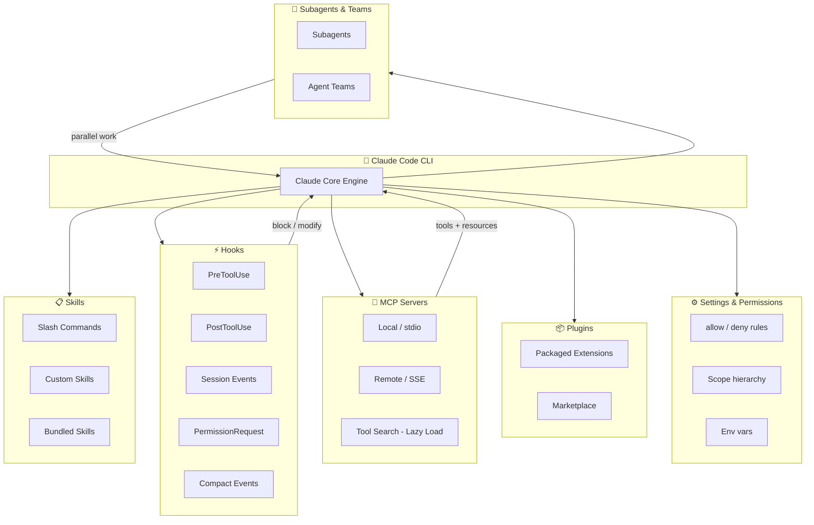

# Claude Code Extensions — AI Enablement Cheat Sheet

> **Audience:** AI Architects, AI Enablement Leads, Platform Engineers
> **Scope:** Claude Code extension ecosystem — MCP servers, hooks, skills, subagents, plugins, and settings
> **Last updated:** 2026-04-19 — verified against [Claude Code docs](https://code.claude.com/docs/en/features-overview) and official hooks/settings reference

---

## Extension Architecture Overview



---

## 1. Extension Types — At a Glance

| Type | What it is | Best for | Config location |
|---|---|---|---|
| **Skills** | Markdown files with instructions/workflows, invoked via `/skill` | Repeatable workflows, team knowledge | `.claude/skills/`, `~/.claude/skills/` |
| **Hooks** | Shell scripts / HTTP / prompts triggered by lifecycle events | Guardrails, automation, notifications | `settings.json` → `hooks` key |
| **MCP Servers** | External tool providers connected via Model Context Protocol | Integrating external APIs, data sources, dev tools | `.mcp.json` (project), `~/.claude.json` (user) |
| **Subagents** | Isolated Claude sessions spawned for parallel or isolated work | Heavy context tasks, delegation | `.claude/agents/` YAML definitions |
| **Agent Teams** | Collaborative multi-agent squads that message each other | Parallel feature work, coordinated pipelines | `.claude/agents/` + orchestration |
| **Plugins** | Packaged bundle of skills + hooks + MCP + settings | Team distribution, marketplace sharing | `settings.json` → `plugins` key |

> **Rule of thumb:** Skills + MCP → 80% of workflows. Hooks → automate guardrails. Subagents → delegate heavy context. Agent Teams → go parallel. Plugins → package everything for the team.

---

## 2. MCP Servers

### What MCP Is

Model Context Protocol (MCP) is an open standard (donated to Linux Foundation, Dec 2025) that lets Claude connect to external tools, APIs, and data sources. Adopted by OpenAI and Google DeepMind in early 2025. **MCP Tool Search** (lazy loading) reduces context usage by up to 95% — Claude loads only tools it needs, on demand.

### MCP Transports

| Transport | Use case | Latency | Auth |
|---|---|---|---|
| `stdio` | Local process, same machine | Lowest | Process-level |
| `SSE` (Server-Sent Events) | Remote servers, cloud-hosted | Network | HTTP headers / OAuth |

### Config Format

**Project scope** (`.mcp.json`, committed to git):
```json
{
  "mcpServers": {
    "github": {
      "type": "stdio",
      "command": "npx",
      "args": ["-y", "@modelcontextprotocol/server-github"],
      "env": { "GITHUB_TOKEN": "${GITHUB_TOKEN}" }
    },
    "memory": {
      "type": "sse",
      "url": "https://mcp.example.com/memory"
    }
  }
}
```

**User scope** — stored in `~/.claude.json` (managed via `claude mcp add` CLI command).

### Popular MCP Server Categories

| Category | Examples | Key use cases |
|---|---|---|
| **Dev Tools** | `github`, `gitlab`, `jira`, `linear` | PR management, issue tracking, code review |
| **Filesystem** | `filesystem`, `git` | Scoped file I/O, git operations |
| **Browser/Web** | `playwright`, `puppeteer`, `firecrawl` | Browser automation, web scraping |
| **Data & DBs** | `postgres`, `sqlite`, `bigquery`, `snowflake` | Query execution, schema inspection |
| **Cloud** | `aws-kb-retrieval`, `gcp-vertex`, `azure-ai-search` | Cloud service integration |
| **Productivity** | `slack`, `google-drive`, `notion`, `obsidian` | Team comms, document access |
| **AI/Memory** | `memory`, `qdrant`, `chroma` | Agent memory, vector retrieval |
| **Observability** | `datadog`, `grafana`, `sentry` | Log search, alert management |

### Discovery

- **Official registry:** `https://api.anthropic.com/mcp-registry/v0/servers` — Anthropic-curated, commercial-grade servers
- **Community:** [Smithery](https://smithery.ai), [Glama](https://glama.ai/mcp), npm (`@modelcontextprotocol/*`)
- **CLI:** `claude mcp search <query>`, `claude mcp add <server>`

### Enterprise Controls

| Setting | Purpose |
|---|---|
| `allowedMcpServers` | Allowlist — only listed servers permitted (managed settings) |
| `deniedMcpServers` | Denylist — always blocked, takes precedence over allowlist |
| `allowManagedMcpServersOnly` | Only admin-defined MCP servers apply |
| `disabledMcpjsonServers` | Block specific servers from `.mcp.json` |
| `enableAllProjectMcpServers` | Auto-approve all project-scoped servers |

---

## 3. Hooks

### Hook Event Reference

| Event | Trigger | Can Block? | Common use |
|---|---|---|---|
| `SessionStart` | New/resumed session | No | Load context, announce policy |
| `UserPromptSubmit` | User submits prompt | **Yes** | Input validation, PII scan |
| `PreToolUse` | Before tool executes | **Yes** | Guardrails, dry-run, approval gate |
| `PermissionRequest` | Permission dialog shown | **Yes** | Auto-approve safe patterns |
| `PermissionDenied` | Auto mode denies call | No | Logging |
| `PostToolUse` | Tool succeeds | No | Notifications, downstream triggers |
| `PostToolUseFailure` | Tool fails | No | Alerting, retry logic |
| `SubagentStart` | Subagent spawned | No | Audit trail |
| `SubagentStop` | Subagent finishes | **Yes** | Validate output before returning |
| `Stop` | Claude finishes response | **Yes** | Post-response validation |
| `TaskCreated` | Task created | **Yes** | Approval workflow |
| `TaskCompleted` | Task marked complete | **Yes** | QA gate |
| `TeammateIdle` | Teammate going idle | **Yes** | Coordination |
| `PreCompact` | Before context compaction | **Yes** | Save state, checkpoint |
| `PostCompact` | After compaction | No | Restore state |
| `ConfigChange` | Config file changes | **Yes** | Policy enforcement |
| `FileChanged` | Watched file changes | No | Live reload, linting |
| `InstructionsLoaded` | CLAUDE.md loaded | No | Audit which instructions loaded |
| `Elicitation` | MCP requests user input | **Yes** | Auto-respond or gate |
| `WorktreeCreate` | Worktree created | **Yes** | Provisioning |
| `WorktreeRemove` | Worktree removed | No | Cleanup |
| `SessionEnd` | Session terminates | No | Cleanup, stale file check |
| `Notification` | Notification sent | No | External alerting |

### Exit Code Behavior

| Exit code | Meaning |
|---|---|
| `0` | Success — stdout parsed as JSON for structured output |
| `2` | Block (for blockable events) — stderr fed back to Claude as error |
| Other | Non-blocking error — stderr shown in transcript |

### Hook Handler Types

| Type | Config | Best for |
|---|---|---|
| `command` | Shell script via stdin/stdout | Local automation, git checks |
| `http` | POST to URL with JSON body | Webhooks, external approval APIs |
| `prompt` | Single-turn Claude evaluation | LLM-based guardrails |
| `agent` | Subagent with tool access | Complex validation logic |

### Hook Config Format

```json
{
  "hooks": {
    "PreToolUse": [
      {
        "matcher": "Bash",
        "hooks": [
          {
            "type": "command",
            "command": ".claude/hooks/check-destructive.sh"
          }
        ]
      }
    ],
    "PostToolUse": [
      {
        "matcher": "Write|Edit",
        "hooks": [
          {
            "type": "http",
            "url": "https://hooks.example.com/file-changed"
          }
        ]
      }
    ]
  }
}
```

### Matcher Patterns

| Pattern | Matches | Example |
|---|---|---|
| `"*"` or omitted | All events | All Bash calls |
| Alphanumeric + `\|` | Exact tool name | `Bash` or `Write\|Edit` |
| Regex | Pattern match | `^Notebook`, `mcp__memory__.*` |
| MCP tools | `mcp__<server>__<tool>` | `mcp__github__create_pr` |

### Common Input Fields (all hooks)

```json
{
  "session_id": "abc123",
  "transcript_path": "/path/to/transcript.jsonl",
  "cwd": "/current/dir",
  "permission_mode": "default|plan|acceptEdits|auto|dontAsk|bypassPermissions",
  "hook_event_name": "PreToolUse"
}
```

---

## 4. Skills (Slash Commands)

### What Skills Are

Skills are markdown files containing knowledge, workflows, or instructions. Invoked with `/skill-name` in the prompt. Claude loads the skill's content as context and executes the defined workflow.

### Skill Types

| Type | Location | Managed by | Override-able |
|---|---|---|---|
| **Bundled** | Built into Claude Code | Anthropic | No |
| **User skills** | `~/.claude/skills/` | Individual user | Yes |
| **Project skills** | `.claude/skills/` | Team (git) | Yes |
| **Plugin skills** | Loaded from plugin | Plugin author | Via policy |
| **Agent skills** | YAML frontmatter in agent def | Agent author | Scoped |

### Skill File Structure

```markdown
---
name: deploy
description: Deploys the app to the target environment
triggers:
  - /deploy
hooks:
  SessionStart:
    - type: command
      command: ./validate-env.sh
---

# Deploy Workflow

1. Check environment variables
2. Run `npm run build`
3. Deploy to `$DEPLOY_TARGET`
4. Validate health endpoint
```

### Common Built-in Skills (partial list)

| Skill | What it does |
|---|---|
| `/review` | Architecture review checklist |
| `/adr` | Generate ADR from description |
| `/clear` | Clear conversation context |
| `/compact` | Compact conversation with summary |
| `/model` | Switch model |
| `/config` | Open settings UI |
| `/mcp` | Manage MCP servers |
| `/cost` | Show session token cost |

### Enterprise Controls

| Setting | Purpose |
|---|---|
| `disableSkillShellExecution` | Block `!command` in user/project skills |
| `enabledPlugins` | Force-enable specific plugin skills |
| Plugin `allowedSkills` | Restrict which skills a plugin exposes |

---

## 5. Subagents & Agent Teams

> Launched **February 5, 2026** alongside Opus 4.6.

### Subagents vs Agent Teams

| | Subagents | Agent Teams |
|---|---|---|
| **Model** | Isolated worker → reports to boss | Collaborative squad, peer messaging |
| **Use case** | Delegate heavy-context tasks | Parallel coordinated work |
| **Communication** | One-way result return | Bi-directional messaging |
| **Config** | `.claude/agents/*.md` YAML | `.claude/agents/*.md` + team config |
| **Context** | Independent context window | Shared team context + own window |

### Subagent Definition

```yaml
---
name: code-reviewer
description: Reviews PRs for security and style issues
model: claude-sonnet-4-6
tools:
  - Read
  - Grep
  - WebFetch
hooks:
  SubagentStop:
    - type: command
      command: .claude/hooks/validate-review.sh
---

You are a strict code reviewer. Focus on security vulnerabilities and OWASP Top 10.
```

---

## 6. Settings & Permissions

### Scope Hierarchy (highest → lowest precedence)

| Scope | Location | Who it affects | Shared? |
|---|---|---|---|
| **Managed** | Server / MDM / registry / `managed-settings.json` | All users on machine | Yes (IT-deployed) |
| **Command line** | `--permission-mode`, `--model` flags | Current session only | No |
| **Local** | `.claude/settings.local.json` | You, this project only | No (gitignored) |
| **Project** | `.claude/settings.json` | All collaborators | Yes (git) |
| **User** | `~/.claude/settings.json` | You, all projects | No |

### Key Settings Reference

| Key | Purpose | Example |
|---|---|---|
| `permissions.allow` | Allowlist specific tool calls | `["Bash(npm run test *)", "Read(~/.zshrc)"]` |
| `permissions.deny` | Block tool calls permanently | `["Bash(curl *)", "Read(./.env)"]` |
| `hooks` | Lifecycle hook config | See Section 3 |
| `env` | Session environment variables | `{"FOO": "bar"}` |
| `availableModels` | Restrict model selection | `["sonnet", "haiku"]` |
| `alwaysThinkingEnabled` | Enable extended thinking by default | `true` |
| `effortLevel` | Persist effort level | `"xhigh"` |
| `autoUpdatesChannel` | Release channel | `"stable"` or `"latest"` |
| `companyAnnouncements` | Startup message for team | `["Welcome to Acme Corp!"]` |
| `disableAllHooks` | Kill-switch for all hooks | `true` |
| `disableAutoMode` | Prevent auto permission mode | `"disable"` |
| `apiKeyHelper` | Custom script for auth token | `"/bin/generate_key.sh"` |
| `cleanupPeriodDays` | Session file retention (default 30) | `20` |
| `agent` | Run session as named subagent | `"code-reviewer"` |
| `attribution` | Git commit attribution text | `{"commit": "🤖 Claude Code"}` |

### Permission Rule Syntax

```
ToolName(argument-pattern)
```

Examples:
```
Bash(npm run *)          # Allow any npm run subcommand
Bash(rm *)               # Deny rm (pattern match)
Read(~/.zshrc)           # Allow reading specific file
Read(./.env*)            # Deny all .env files
mcp__github__*           # Allow all GitHub MCP tools
```

### Managed Settings Delivery (Enterprise)

| Method | Platform | Notes |
|---|---|---|
| Server-managed | All | Via Claude.ai admin console |
| MDM profile | macOS | `com.anthropic.claudecode` preference domain |
| Registry key | Windows | `HKLM\SOFTWARE\Policies\ClaudeCode` |
| File-based | All | `managed-settings.json` in system dir |
| Drop-in dir | All | `managed-settings.d/*.json` — alphabetically merged |

---

## 7. Building a Custom MCP Server

### Minimal Python MCP Server

```python
from mcp.server import Server
from mcp.server.stdio import stdio_server
from mcp import Tool, TextContent
import asyncio

app = Server("my-tools")

@app.list_tools()
async def list_tools():
    return [
        Tool(name="get_status", description="Get system status",
             inputSchema={"type": "object", "properties": {}})
    ]

@app.call_tool()
async def call_tool(name: str, arguments: dict):
    if name == "get_status":
        return [TextContent(type="text", text="All systems nominal")]

asyncio.run(stdio_server(app))
```

### Registration in `.mcp.json`

```json
{
  "mcpServers": {
    "my-tools": {
      "type": "stdio",
      "command": "python",
      "args": [".claude/mcp/my_tools.py"]
    }
  }
}
```

### MCP Server Checklist for Builders

- [ ] Define tool schemas with JSON Schema input validation
- [ ] Return structured errors (not exceptions) for bad inputs
- [ ] Implement `list_tools` and `call_tool` handlers
- [ ] Use environment variables for secrets (never hardcode)
- [ ] Test locally with `claude mcp add --local ./server.py` then `/mcp` to verify
- [ ] For remote servers: implement OAuth or bearer token auth
- [ ] Add to `.mcp.json` for team sharing or `~/.claude.json` for personal use

---

## 8. Quick Reference: Use Case → Extension Type

| I need to… | Use | Config |
|---|---|---|
| Add a new external tool or API | **MCP Server** | `.mcp.json` |
| Invoke a repeatable workflow with `/command` | **Skill** | `.claude/skills/` |
| Block destructive commands before they run | **PreToolUse Hook** | `settings.json → hooks` |
| Run validation after every file write | **PostToolUse Hook** | `settings.json → hooks` |
| Scan user input for PII before Claude sees it | **UserPromptSubmit Hook** | `settings.json → hooks` |
| Notify Slack when Claude finishes a task | **Stop / PostToolUse Hook** (http type) | `settings.json → hooks` |
| Delegate a large task with its own context | **Subagent** | `.claude/agents/` |
| Run multiple agents in parallel | **Agent Team** | `.claude/agents/` |
| Restrict what Claude can do project-wide | **Settings permissions** | `.claude/settings.json` |
| Enforce org-wide security policy | **Managed Settings** | `managed-settings.json` |
| Package extensions for team distribution | **Plugin** | `settings.json → plugins` |
| Connect to GitHub / Jira / Slack | **MCP Server** (official or community) | `.mcp.json` |
| Run LLM-based guardrail on tool calls | **PreToolUse Hook** (prompt type) | `settings.json → hooks` |
| Auto-approve safe Bash patterns | **PermissionRequest Hook** | `settings.json → hooks` |
| Load context at session start | **SessionStart Hook** or **CLAUDE.md** | `.claude/` |

---

## Sources & Further Reading

- [Claude Code Docs](https://code.claude.com/docs/en/features-overview) — official reference
- [Hooks Reference](https://code.claude.com/docs/en/hooks) — all event types, input schemas, exit codes
- [Settings Reference](https://code.claude.com/docs/en/settings) — full settings key list + JSON schema
- [MCP Docs](https://code.claude.com/docs/en/mcp) — server config, transports, managed MCP
- [MCP Registry](https://api.anthropic.com/mcp-registry/v0/servers) — Anthropic-curated server catalog
- [MCP GitHub org](https://github.com/modelcontextprotocol) — official reference servers
- [Smithery](https://smithery.ai) / [Glama](https://glama.ai/mcp) — community MCP discovery
