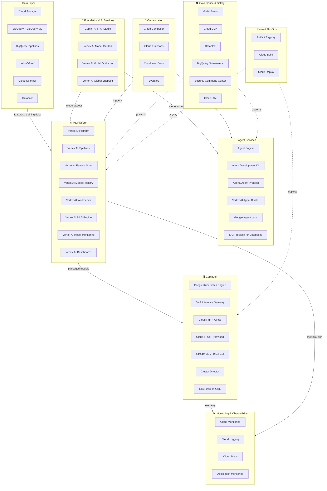

# GCP-Native AI Tech Stack — AIEnablement & MLOps Cheat Sheet

> **Audience:** AI Architects, MLOps Engineers, AI Enablement Leads
> **Scope:** Google Cloud 1st-party services + key Google SDKs used in AIEnablement and MLOps code
> **Last updated:** 2026-04-17 — verified against Google Cloud Next 2025 and Vertex AI release notes

---

## Architecture Overview

---

## 1. Foundation & AI Services

| Service | Purpose | Key MLOps / AIEnablement Use | Docs |
|---|---|---|---|
| **Gemini API / Google AI Studio** | Access to Gemini model family — 2.5 Pro (complex reasoning), 2.5 Flash (low latency), 3.1 Flash-Lite (high-volume cost-efficient) | LLM inference, multimodal I/O, streaming; Flash-Lite for high-volume cost-sensitive pipelines | [docs](https://ai.google.dev/docs) |
| **Vertex AI Model Garden** | Unified model catalog — Gemini, Llama 4, Mistral, Imagen, Veo, Chirp, and more; 1st-party + partner + open models | Discover, evaluate, and deploy models; single endpoint for all model families | [docs](https://cloud.google.com/vertex-ai/docs/model-garden/explore-models) |
| **Vertex AI Model Optimizer** *(GA)* | Automatically selects the best model per prompt based on quality/cost targets | Reduce token cost without manual routing logic; dynamically routes across Gemini model tiers | [docs](https://cloud.google.com/vertex-ai/generative-ai/docs/model-reference/model-optimizer) |
| **Vertex AI Global Endpoint** *(GA)* | Capacity-aware routing across multiple regions for Gemini models | High-availability LLM serving; automatic failover and load balancing across regions | [docs](https://cloud.google.com/vertex-ai/generative-ai/docs/multimodal/global-endpoint) |
| **Live API** *(GA)* | Streaming audio and video directly into Gemini for real-time multimodal processing | Voice agents, real-time document analysis, live video understanding in AI pipelines | [docs](https://ai.google.dev/api/live) |

---

## 2. Agent Services

| Service | Purpose | Key MLOps / AIEnablement Use | Docs |
|---|---|---|---|
| **Agent Engine** *(GA)* | Fully managed runtime for deploying custom agents to production — testing, release management, reliability | Deploy agents without managing infra; built-in versioning and rollback for agent logic | [docs](https://cloud.google.com/vertex-ai/generative-ai/docs/agent-engine/overview) |
| **Agent Development Kit (ADK)** *(GA, open source)* | Open-source multi-agent framework — supports MCP, A2A protocol, streaming, tool use | Build production multi-agent systems; composable agent graphs with explicit control flow | [docs](https://google.github.io/adk-docs/) |
| **Agent2Agent (A2A) Protocol** *(GA)* | Open standard for agent interoperability across frameworks and models; 50+ ecosystem partners | Enable cross-framework agent communication; interop with non-Google agents | [docs](https://developers.googleblog.com/en/a2a-a-new-era-of-agent-interoperability/) |
| **Vertex AI Agent Builder** *(GA)* | Build search and RAG-based agents — Vertex AI Search, data stores, grounding, tool governance | Enterprise search agents; ground agents in internal documents, BigQuery, and web content | [docs](https://cloud.google.com/generative-ai-app-builder/docs/agent-intro) |
| **Google Agentspace** *(GA)* | Enterprise agent platform — Deep Research, Idea Generation, Agent Designer, Agent Gallery | Enable business users to access AI agents via natural language; integrate with Google Workspace | [docs](https://workspace.google.com/products/agentspace/) |
| **MCP Toolbox for Databases** *(GA)* | Model Context Protocol integration with enterprise databases — Cloud SQL, Spanner, AlloyDB, BigQuery | Give agents structured, governed access to enterprise databases via MCP | [docs](https://cloud.google.com/blog/products/databases/introducing-mcp-toolbox-for-databases) |
| **Vertex AI RAG Engine** *(GA — Feb 2025)* | Production-grade RAG — chunking, embedding, retrieval, grounding; addresses demo-to-prod gap | Build reliable RAG pipelines with managed indexing and retrieval; integrates with Vertex AI Search | [docs](https://cloud.google.com/vertex-ai/generative-ai/docs/rag-engine/rag-overview) |

---

## 3. ML Platform

| Service | Purpose | Key MLOps / AIEnablement Use | Docs |
|---|---|---|---|
| **Vertex AI** | Core ML platform — training, experiments, pipelines, model registry, feature store, batch/online prediction | End-to-end ML lifecycle on a single platform; deep BigQuery and GKE integration | [docs](https://cloud.google.com/vertex-ai/docs) |
| **Vertex AI Pipelines** | Managed Kubeflow Pipelines — reusable ML workflow DAGs | Automated retraining — data prep → train → evaluate → register → deploy | [docs](https://cloud.google.com/vertex-ai/docs/pipelines/introduction) |
| **Vertex AI Feature Store** | Centralised online + offline feature serving with point-in-time correctness | Feature reuse across teams; consistent features for training and real-time inference | [docs](https://cloud.google.com/vertex-ai/docs/featurestore/overview) |
| **Vertex AI Model Registry** | Versioned model store with lineage tracking and deployment history | Govern model promotion; link model versions to training pipelines and evaluations | [docs](https://cloud.google.com/vertex-ai/docs/model-registry/introduction) |
| **Vertex AI Workbench** | Managed JupyterLab notebooks with direct Vertex AI integration | Data science development environment with one-click training job submission | [docs](https://cloud.google.com/vertex-ai/docs/workbench/introduction) |
| **Vertex AI Experiments** | Track, compare, and visualise training runs and hyperparameter sweeps | Experiment management with TensorBoard integration; compare metrics across runs | [docs](https://cloud.google.com/vertex-ai/docs/experiments/intro-vertex-ai-experiments) |
| **Vertex AI Model Monitoring** | Production model health — feature skew, prediction drift, data quality alerts | Detect model degradation; trigger retraining on statistical drift thresholds | [docs](https://cloud.google.com/vertex-ai/docs/model-monitoring/overview) |
| **Vertex AI Dashboards** *(GA)* | Real-time monitoring of model deployments — usage, throughput, latency, error rates | Single-pane visibility across all deployed models and endpoints | [docs](https://cloud.google.com/vertex-ai/docs/general/monitoring) |
| **BigQuery ML** | In-database ML — train and serve models directly in BigQuery SQL | Rapid prototyping without data movement; production ML for SQL-native teams | [docs](https://cloud.google.com/bigquery/docs/bqml-introduction) |

---

## 4. Data Layer

| Service | Purpose | Key MLOps / AIEnablement Use | Docs |
|---|---|---|---|
| **Google Cloud Storage (GCS)** | Object storage — unlimited scale, multi-region, lifecycle management | Training datasets, model artifacts, checkpoint storage, feature snapshots | [docs](https://cloud.google.com/storage/docs) |
| **BigQuery** | Serverless data warehouse — petabyte scale, built-in ML, semantic search | Large-scale feature engineering; BigQuery Semantic Search for agent grounding | [docs](https://cloud.google.com/bigquery/docs) |
| **BigQuery Pipelines** *(GA)* | Native data pipeline builder within BigQuery | Build and orchestrate data transformation pipelines without leaving BigQuery | [docs](https://cloud.google.com/bigquery/docs/pipelines-overview) |
| **BigQuery Universal Catalog** *(GA)* | Combined data catalog + fully managed metastore with Iceberg support | Unified metadata for data discovery; engine interoperability (BigQuery, Spark, Flink) | [docs](https://cloud.google.com/bigquery/docs/universal-catalog-intro) |
| **AlloyDB AI** *(GA)* | PostgreSQL-compatible database with native vector search, Gemini embeddings, and multimodal retrieval | Operational RAG — combine vector search with transactional data in one database | [docs](https://cloud.google.com/alloydb/docs/ai/overview) |
| **Cloud Spanner with Vector Search** *(GA)* | Globally distributed SQL database with vector search alongside SQL, graph, and full-text | Vector search at global scale with strong consistency; multi-modal retrieval | [docs](https://cloud.google.com/spanner/docs/find-k-nearest-neighbors) |
| **Dataflow** | Managed Apache Beam — unified batch and streaming data processing | Scalable data prep and feature engineering pipelines; real-time feature computation | [docs](https://cloud.google.com/dataflow/docs) |
| **Pub/Sub** | Managed event streaming — at-scale message delivery | Trigger ML pipelines on data events; streaming features for real-time inference | [docs](https://cloud.google.com/pubsub/docs) |

---

## 5. Compute

| Service | Purpose | Key MLOps / AIEnablement Use | Docs |
|---|---|---|---|
| **Google Kubernetes Engine (GKE)** | Managed Kubernetes — production container orchestration | Scalable model serving, multi-model inference clusters, ML platform tooling | [docs](https://cloud.google.com/kubernetes-engine/docs) |
| **GKE Inference Gateway** *(GA)* | Intelligent load balancing and auto-scaling for generative AI models on GKE | Optimise GPU utilisation, route requests by model/version, scale to zero | [docs](https://cloud.google.com/kubernetes-engine/docs/concepts/inference-gateway) |
| **Cloud Run + GPUs** *(GA)* | Serverless containers with GPU support — scale to zero | Low-ops GPU inference; event-driven model serving without cluster management | [docs](https://cloud.google.com/run/docs/configuring/services/gpu) |
| **Ironwood TPU (7th gen)** *(GA — Q2 2025)* | Google's purpose-built inference chip — optimised for large-scale model serving | High-throughput, cost-efficient inference for Gemini-scale models | [docs](https://cloud.google.com/tpu/docs/system-architecture-tpu-vm) |
| **A4 / A4X VMs** | NVIDIA Blackwell GPU instances — A4 (B200), A4X (GB200) | Frontier model training and high-performance inference workloads | [docs](https://cloud.google.com/compute/docs/gpus) |
| **Cluster Director** *(GA)* | Manage large GPU/TPU clusters as a single unit — topology-aware scheduling, Slurm support | Simplify large-scale distributed training across thousands of accelerators | [docs](https://cloud.google.com/cluster-director/docs) |
| **RayTurbo on GKE** *(GA)* | Optimised Ray — 4.5× faster data processing, 50% fewer nodes for serving | Distributed ML workloads (training, tuning, batch inference) with Ray on managed GKE | [docs](https://cloud.google.com/kubernetes-engine/docs/concepts/ray-on-gke) |

---

## 6. Orchestration

| Service | Purpose | Key MLOps / AIEnablement Use | Docs |
|---|---|---|---|
| **Vertex AI Pipelines** | Managed Kubeflow Pipelines — ML-specific DAG orchestration | Automated retraining and evaluation pipelines with Vertex AI native integration | [docs](https://cloud.google.com/vertex-ai/docs/pipelines/introduction) |
| **Cloud Composer** | Managed Apache Airflow — complex workflow orchestration with 750+ operators | Complex ML pipelines with external system dependencies; teams invested in Airflow | [docs](https://cloud.google.com/composer/docs) |
| **Cloud Functions** | Serverless event-driven compute — sub-second cold start | Lightweight inference triggers, pre/post-processing, ML pipeline webhooks | [docs](https://cloud.google.com/functions/docs) |
| **Eventarc** | Managed event routing across Google Cloud services | Trigger ML pipelines on GCS data arrival, BigQuery job completion, or Pub/Sub messages | [docs](https://cloud.google.com/eventarc/docs) |
| **Cloud Workflows** | Serverless workflow orchestration for multi-step processes | Orchestrate multi-service AI workflows (data → model → eval → deploy) with retry logic | [docs](https://cloud.google.com/workflows/docs) |

---

## 7. Monitoring & Observability

| Service | Purpose | Key MLOps / AIEnablement Use | Docs |
|---|---|---|---|
| **Cloud Monitoring** | Platform-wide metrics, alerting, dashboards, SLOs | Endpoint SLA tracking, training job health, quota utilisation, cost alerts | [docs](https://cloud.google.com/monitoring/docs) |
| **Cloud Logging** | Managed log aggregation with structured query (Log Analytics) | Centralised logs for ML pipelines, agent traces, and model serving requests | [docs](https://cloud.google.com/logging/docs) |
| **Cloud Trace** | Distributed tracing — latency profiling across microservices | Trace LLM app requests across Cloud Run, Vertex AI endpoints, and agent tools | [docs](https://cloud.google.com/trace/docs) |
| **Vertex AI Model Monitoring** | Feature skew, prediction drift, data quality monitoring for deployed models | Detect model degradation post-deployment; auto-alert on statistical threshold breaches | [docs](https://cloud.google.com/vertex-ai/docs/model-monitoring/overview) |
| **Vertex AI Dashboards** *(GA)* | Real-time model deployment health — usage, throughput, latency, errors | Single-pane observability across all Vertex AI endpoints | [docs](https://cloud.google.com/vertex-ai/docs/general/monitoring) |
| **Application Monitoring** *(Preview)* | Auto-tags telemetry (logs, metrics, traces) with application context for correlated views | Correlate AI app behaviour with infrastructure events; application-centric troubleshooting | [docs](https://cloud.google.com/stackdriver/docs/solutions/slo-monitoring) |

---

## 8. Governance & Safety

| Service | Purpose | Key MLOps / AIEnablement Use | Docs |
|---|---|---|---|
| **Model Armor** | Safety guardrails for LLM inputs/outputs — prompt injection detection, content filtering, grounding checks | Apply consistent safety policies across all Gemini and third-party model calls | [docs](https://cloud.google.com/security/products/model-armor) |
| **Cloud DLP** (Data Loss Prevention) | ML-powered PII detection, classification, and de-identification | Scan training datasets for sensitive data; redact PII before model training | [docs](https://cloud.google.com/dlp/docs) |
| **Dataplex** | Unified data governance — cataloguing, lineage, quality, classification across GCP | Track training data lineage, enforce data quality rules, classify datasets | [docs](https://cloud.google.com/dataplex/docs) |
| **BigQuery Governance** *(Preview)* | Unified discovery, classification, curation, quality, usage, and sharing for BigQuery assets | Govern training data assets — data quality rules, usage tracking, sensitivity classification | [docs](https://cloud.google.com/bigquery/docs/data-governance) |
| **Security Command Center** *(GA)* | Centralised AI security threat monitoring — vulnerability detection, misconfiguration alerts | Monitor ML infrastructure security posture; detect anomalous access to model endpoints | [docs](https://cloud.google.com/security-command-center/docs) |
| **Cloud IAM** | Identity and access management — roles, service accounts, workload identity | Least-privilege access for ML workloads; Workload Identity Federation for CI/CD | [docs](https://cloud.google.com/iam/docs) |
| **VPC Service Controls** | Perimeter-based data exfiltration prevention for Google Cloud services | Prevent data exfiltration from training datasets and model artifacts | [docs](https://cloud.google.com/vpc-service-controls/docs) |

---

## 9. Infra & DevOps

| Service | Purpose | Key MLOps / AIEnablement Use | Docs |
|---|---|---|---|
| **Artifact Registry** | Private registry for Docker images, Python packages, Maven, npm | Store training container images, model serving containers, Python packages | [docs](https://cloud.google.com/artifact-registry/docs) |
| **Cloud Build** | Managed CI/CD — serverless build system with native GCP integration | Trigger ML pipeline runs, build and push model containers, run evaluations on PR | [docs](https://cloud.google.com/build/docs) |
| **Cloud Deploy** | Managed continuous delivery with promotion workflows and rollback | Promote models through environments (dev → staging → prod) with approval gates | [docs](https://cloud.google.com/deploy/docs) |

---

## 10. SDKs & Developer Tools

### Model Access & Agents

| SDK | Languages | Purpose | Key Use | Status | Docs |
|---|---|---|---|---|---|
| **google-generativeai** (Gemini SDK) | Python, JS/TS, Go, Swift, Dart | Access Gemini models via Google AI Studio or Vertex AI | Direct Gemini inference, multimodal I/O, streaming, function calling | **GA** | [docs](https://ai.google.dev/gemini-api/docs/quickstart) |
| **google-adk** (Agent Development Kit) | Python | Build, run, and deploy multi-agent systems with ADK | Define agent graphs, connect tools, deploy to Agent Engine | **GA** | [docs](https://google.github.io/adk-docs/) |
| **Genkit** | Python, TypeScript, Go | Open-source AI app framework — flows, tools, plugins, evaluations | Build LLM-powered features with built-in eval and observability; deploy to Cloud Run | **GA** | [docs](https://firebase.google.com/docs/genkit) |

### ML Platform

| SDK | Languages | Purpose | Key Use | Status | Docs |
|---|---|---|---|---|---|
| **google-cloud-aiplatform** (Vertex AI SDK) | Python | Primary Vertex AI SDK — training, pipelines, model registry, endpoints, evaluation | Author training jobs, run Vertex AI Pipelines, deploy models, call Gemini via Vertex | **GA** | [docs](https://cloud.google.com/python/docs/reference/aiplatform/latest) |
| **kfp** (Kubeflow Pipelines SDK) | Python | Define Vertex AI Pipelines as Python DSL — components, pipelines, artifacts | Build reusable pipeline components; compile and submit pipelines to Vertex AI | **GA** | [docs](https://www.kubeflow.org/docs/components/pipelines/sdk/sdk-overview/) |

### Data & Infra

| SDK | Languages | Purpose | Key Use | Status | Docs |
|---|---|---|---|---|---|
| **google-cloud-bigquery** | Python, Java, Go | BigQuery client — query, load, extract, and manage datasets | Feature engineering at scale; BigQuery ML model training via Python | **GA** | [docs](https://cloud.google.com/python/docs/reference/bigquery/latest) |
| **google-auth** | Python | Google Cloud authentication — Application Default Credentials | Credential-free auth for all GCP SDKs in production; works locally and in cloud | **GA** | [docs](https://google-auth.readthedocs.io/) |
| **Terraform (Google provider)** | HCL | Infrastructure as code for GCP resources | Define and version ML infrastructure (Vertex AI, GKE, IAM, storage) as code | **GA** | [docs](https://registry.terraform.io/providers/hashicorp/google/latest/docs) |

---

## Quick Reference: Concern → Service Mapping

| Architectural Concern | Primary Services |
|---|---|
| LLM access & model selection | Gemini API, Vertex AI Model Garden, Model Optimizer |
| Agent building & orchestration | ADK, Agent Engine, Vertex AI Agent Builder |
| Agent-to-agent communication | A2A Protocol, ADK |
| Enterprise data grounding (RAG) | Vertex AI RAG Engine, Vertex AI Agent Builder, Vertex AI Search |
| Vector store | AlloyDB AI, Cloud Spanner, Vertex AI Feature Store |
| MCP for enterprise databases | MCP Toolbox for Databases |
| Training & experimentation | Vertex AI, A4/A4X VMs, Cloud TPUs, Cluster Director |
| Custom silicon inference | Ironwood TPU, GKE Inference Gateway |
| Fine-tuning | Vertex AI (Gemini, Imagen, Veo tuning) |
| Feature management | Vertex AI Feature Store |
| MLOps pipelines | Vertex AI Pipelines, Cloud Composer |
| Experiment tracking | Vertex AI Experiments |
| Model registry & promotion | Vertex AI Model Registry, Cloud Deploy |
| Model serving (online) | Vertex AI Endpoints, GKE + Inference Gateway, Cloud Run |
| Model serving (batch) | Vertex AI Batch Prediction, Dataflow |
| Data pipelines | Dataflow, BigQuery Pipelines, Cloud Composer, Pub/Sub |
| Monitoring & drift detection | Vertex AI Model Monitoring, Cloud Monitoring |
| LLM observability | Vertex AI Dashboards, Cloud Trace, Application Monitoring |
| Content safety & guardrails | Model Armor |
| Data governance & lineage | Dataplex, BigQuery Governance, Cloud DLP |
| Identity & access | Cloud IAM, Workload Identity Federation |
| CI/CD for ML | Cloud Build, Cloud Deploy, Artifact Registry |
| Infra as code | Terraform (Google provider), Cloud Build |
| **SDK: Gemini inference** | `google-generativeai` |
| **SDK: Vertex AI (all services)** | `google-cloud-aiplatform` |
| **SDK: Agent building** | `google-adk` |
| **SDK: LLM app framework** | Genkit |
| **SDK: ML pipelines** | `kfp` + `google-cloud-aiplatform` |
| **SDK: Feature engineering** | `google-cloud-bigquery` |
| **SDK: Auth** | `google-auth` (Application Default Credentials) |
