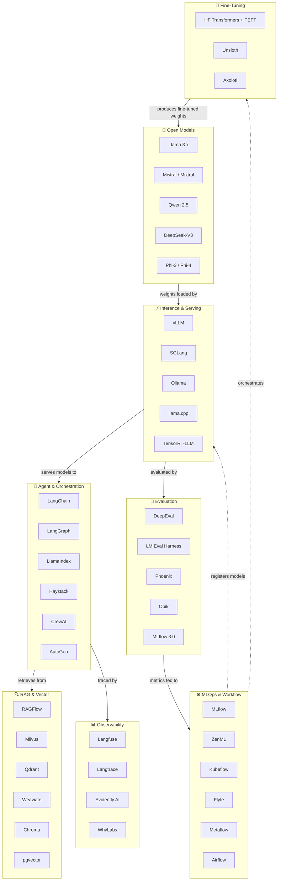

# Open-Source AI & MLOps Tech Stack — AIEnablement Cheat Sheet

> **Audience:** AI Architects, MLOps Engineers, Platform Engineers
> **Scope:** Open-source tools and frameworks for LLM serving, orchestration, RAG, evaluation, observability, and MLOps — cloud-agnostic and self-hostable
> **Last updated:** 2026-04-19 — verified against project releases, GitHub activity, and community benchmarks
> **Complements:** [AWS](aws-ai-mlops-cheatsheet.md) · [Azure](azure-ai-mlops-cheatsheet.md) · [GCP](gcp-ai-mlops-cheatsheet.md) · [Cross-Cloud](cross-cloud-ai-comparison.md)

---

## Architecture Overview

---

## 1. Open-Source LLMs

| Model | Parameters | Strengths | License | Docs / Hub |
|---|---|---|---|---|
| **Llama 3.3** | 8B, 70B, 405B | Strong reasoning, instruction following, long context (128K) | Llama Community License | [hub](https://huggingface.co/meta-llama) |
| **Mistral Small 3** | 24B | Conversational agents, function calling, fast inference | Apache 2.0 | [hub](https://huggingface.co/mistralai) |
| **Mixtral 8x22B** | 141B (MoE, 39B active) | High-throughput MoE, multilingual, code generation | Apache 2.0 | [hub](https://huggingface.co/mistralai) |
| **Qwen 2.5 / Qwen3** | 7B–72B (dense) + 235B MoE | Multilingual, coding (Qwen2.5-Coder), long context (1M) | Apache 2.0 | [hub](https://huggingface.co/Qwen) |
| **DeepSeek-V3** | 671B MoE (37B active) | Frontier reasoning, agentic workloads, cost-efficient MoE | MIT | [hub](https://huggingface.co/deepseek-ai) |
| **Phi-4** | 14B | Strong reasoning at small scale, distillation research | MIT | [hub](https://huggingface.co/microsoft) |
| **Gemma 3** | 1B–27B | Efficient on-device + server inference, multimodal | Gemma Terms of Use | [hub](https://huggingface.co/google) |
| **Command R+** (Cohere) | 104B | Enterprise RAG, long context (128K), grounded generation | CC-BY-NC | [hub](https://huggingface.co/CohereForAI) |

> **Rule of thumb:** For self-hosted production, Llama 3.3 70B or Mistral Small 3 24B cover most use cases. Use MoE models (DeepSeek-V3, Mixtral 8x22B) when throughput matters more than memory footprint.

---

## 2. Inference & Serving

| Tool | Purpose | Key MLOps Use | Status | Docs |
|---|---|---|---|---|
| **vLLM** | High-throughput LLM inference engine — PagedAttention for 80% GPU memory reduction, continuous batching | De facto standard for production self-hosted serving; OpenAI-compatible API; powers Meta, LinkedIn, Roblox | Stable | [docs](https://docs.vllm.ai/) |
| **SGLang** | Structured generation server — RadixAttention for fine-grained KV cache reuse in multi-turn and RAG | High-performance alternative to vLLM for structured outputs and multi-turn workloads | Active | [docs](https://sgl-project.github.io/) |
| **Ollama** | Developer-friendly local LLM runner — one-line model pull + serve | Local dev and prototyping; pairs with OpenWebUI for browser UI; not production-scale | Stable | [docs](https://ollama.com/) |
| **llama.cpp** | CPU/GPU inference via GGUF quantisation — runs on consumer hardware | Edge deployment, cost-sensitive inference, developer laptops | Stable | [github](https://github.com/ggerganov/llama.cpp) |
| **TensorRT-LLM** | NVIDIA-optimised inference backend — quantisation, paged KV cache, speculative decoding | Production GPU serving with maximum throughput on NVIDIA hardware | Stable | [docs](https://nvidia.github.io/TensorRT-LLM/) |
| **KTransformers** | Consumer hardware MoE inference — run 671B DeepSeek on 24 GB GPU + 382 GB RAM | 3–28× speedup vs naive CPU offloading; enables full-size MoE on commodity machines | Maturing | [github](https://github.com/kvcache-ai/ktransformers) |

---

## 3. Agent & Orchestration Frameworks

| Framework | Purpose | Key MLOps / AIEnablement Use | Status | Docs |
|---|---|---|---|---|
| **LangChain** | Modular LLM application framework — chains, agents, tools, memory, callbacks | Standard integration layer for LLM pipelines; extensive tool/loader ecosystem | Stable | [docs](https://python.langchain.com/) |
| **LangGraph** | Graph-based stateful agent orchestration — nodes, edges, checkpointing, human-in-the-loop | Production multi-step agents with explicit state machines; controllable loops and branching | Stable | [docs](https://langchain-ai.github.io/langgraph/) |
| **LlamaIndex** | Data framework for LLM applications — indexing, retrieval, agents, query pipelines | RAG-native agents; multi-modal data ingestion; strong structured data support | Stable | [docs](https://docs.llamaindex.ai/) |
| **Haystack** | Production-grade NLP / AI pipeline framework — modular components, REST API first | Enterprise RAG pipelines; semantic search; strong component isolation for testability | Stable | [docs](https://docs.haystack.deepset.ai/) |
| **CrewAI** | Role-based multi-agent framework — crews, tasks, agents with personas and memory | Collaborative agentic workflows; business process automation with multiple specialist agents | Active | [docs](https://docs.crewai.com/) |
| **AutoGen** (Microsoft) | Conversational multi-agent framework — code execution, tool use, group chat | Research and complex reasoning workflows; code-writing agent teams | Active | [docs](https://microsoft.github.io/autogen/) |
| **Semantic Kernel** (Microsoft) | Enterprise AI SDK for .NET, Python, Java — plugins, planners, memory | Microsoft-stack integration; enterprise Java/.NET teams adopting AI | Active | [docs](https://learn.microsoft.com/semantic-kernel/) |

---

## 4. RAG Frameworks

| Framework | Purpose | Key MLOps / AIEnablement Use | Status | Docs |
|---|---|---|---|---|
| **RAGFlow** | End-to-end open-source RAG engine — deep document understanding, chunking, agent integration | Production-grade RAG with visual pipeline builder; supports PDF, Word, HTML, structured tables | Active | [github](https://github.com/infiniflow/ragflow) |
| **LangChain RAG** | Modular RAG — document loaders, text splitters, embeddings, retriever chains | Flexible composition; widest ecosystem of loaders and vector store integrations | Stable | [docs](https://python.langchain.com/docs/use_cases/question_answering/) |
| **LlamaIndex** | Sophisticated indexing — hierarchical, keyword, knowledge graph, multi-modal | Complex structured/unstructured retrieval; multi-step query decomposition | Stable | [docs](https://docs.llamaindex.ai/en/stable/use_cases/q_and_a/) |
| **Haystack RAG** | Production RAG pipelines — pipeline YAML definitions, A/B testing, REST API | Testable, version-controlled retrieval pipelines; strong separation of components | Stable | [docs](https://docs.haystack.deepset.ai/docs/rag) |
| **RAGatouille** | ColBERT late-interaction retrieval — token-level matching for nuanced retrieval | Plugs into LangChain/LlamaIndex; superior recall for complex queries vs dense embeddings | Maturing | [github](https://github.com/bclavie/RAGatouille) |
| **TxtAI** | All-in-one semantic search + knowledge graph + agent framework — SQLite-backed | Lightweight self-contained RAG for small-to-mid scale; good for edge / embedded use | Active | [docs](https://neuml.github.io/txtai/) |

---

## 5. Vector Databases

| Tool | Purpose | Key MLOps / AIEnablement Use | Scale | Docs |
|---|---|---|---|---|
| **Milvus** | Cloud-native distributed vector DB — separated storage/compute, GPU acceleration | Production-scale RAG; 35K+ GitHub stars; supports HNSW, IVF, DiskANN indexing | Billions of vectors | [docs](https://milvus.io/docs) |
| **Qdrant** | Rust-based vector similarity search — on-disk indexing, payload filtering, quantisation | Fast filtered search; strong Rust performance; gRPC + REST API; good Kubernetes story | Hundreds of millions | [docs](https://qdrant.tech/documentation/) |
| **Weaviate** | Vector DB with built-in ML model integration and hybrid search (BM25 + vector) | RAG with built-in reranking; multi-tenancy for SaaS products; GraphQL API | Hundreds of millions | [docs](https://weaviate.io/developers/weaviate) |
| **Chroma** | Lightweight embedding DB designed for LLM dev — pluggable knowledge/skills | Rapid prototyping and local dev; minimal ops; integrates natively with LangChain/LlamaIndex | Millions | [docs](https://docs.trychroma.com/) |
| **pgvector** | PostgreSQL extension for vector similarity search — no new infrastructure | Pragmatic choice when team already operates Postgres; handles tens of millions of vectors effectively | Tens of millions | [github](https://github.com/pgvector/pgvector) |
| **Elasticsearch / OpenSearch** | Full-text + vector hybrid search — mature ops tooling | Teams with existing ES/OS investment; dense + sparse retrieval in one system | Billions of docs | [docs](https://www.elastic.co/guide/en/elasticsearch/reference/current/dense-vector.html) |

> **Selection guide:** rapid dev → Chroma or pgvector · growing apps → Qdrant or Weaviate · large-scale → Milvus · existing ES/OS estate → OpenSearch

---

## 6. Evaluation Frameworks

| Tool | Purpose | Key MLOps / AIEnablement Use | Status | Docs |
|---|---|---|---|---|
| **DeepEval** | LLM testing framework — 14+ metrics (G-Eval, hallucination, answer relevancy, faithfulness) | Pytest-native LLM unit tests; CI/CD integration for eval gates; LLM-as-a-judge | Active | [docs](https://docs.confident-ai.com/) |
| **LM Evaluation Harness** (EleutherAI) | Standardised benchmarking — 60+ tasks (MMLU, HellaSwag, Big-Bench, TruthfulQA) | Reproducible model comparison; custom task addition; used by most model release papers | Stable | [github](https://github.com/EleutherAI/lm-evaluation-harness) |
| **Phoenix** (Arize) | Self-hosted LLM observability + evaluation — tracing, built-in evaluators, prompt versioning | Integrated eval + observability; open-source core (MIT); no vendor lock-in | Active | [docs](https://docs.arize.com/phoenix) |
| **Opik** (Comet) | Agent reliability evaluation — complex agentic workflow monitoring and testing | Designed for multi-step agent evaluation; tracks tool call sequences and outcomes | Active | [docs](https://www.comet.com/docs/opik/) |
| **MLflow 3.0** | Evolved to GenAI evals — hallucination detection, LLM-as-a-judge, trace-based evaluation | Unified eval + experiment tracking + model registry; strong MLOps integration | Stable | [docs](https://mlflow.org/docs/latest/llms/index.html) |
| **RAGAS** | RAG-specific evaluation — faithfulness, answer relevancy, context precision/recall | Purpose-built metrics for RAG pipelines; integrates with LangChain and LlamaIndex | Active | [docs](https://docs.ragas.io/) |

---

## 7. LLM Observability

| Tool | Purpose | Key MLOps / AIEnablement Use | Status | Docs |
|---|---|---|---|---|
| **Langfuse** | Open-source LLM engineering platform — tracing, prompt management, evals, datasets (MIT core) | Production LLM call tracing; token cost tracking; A/B prompt experiments; self-hostable | Stable | [docs](https://langfuse.com/docs) |
| **Phoenix** (Arize) | Tracing + evaluation + experiments — OpenTelemetry-native, integrates LangChain/LlamaIndex/Bedrock | Unified eval and observability; spans and traces for every LLM call and retrieval step | Active | [docs](https://docs.arize.com/phoenix) |
| **Langtrace** | LLM monitoring — token usage, latency, quality indicators, customisable evaluations | Lightweight observability for teams wanting quick integration without Langfuse complexity | Active | [docs](https://docs.langtrace.ai/) |
| **Evidently AI** | Open-source ML + LLM monitoring — 100+ built-in metrics, 20M+ downloads | Data drift, model drift, and LLM quality monitoring; report generation and alerting | Stable | [docs](https://docs.evidentlyai.com/) |
| **WhyLabs** | Privacy-preserving AI observability — model drift, prompt injection detection, data leakage | Security-conscious teams; detects prompt injection and PII leakage in production | Active | [docs](https://docs.whylabs.ai/) |
| **OpenTelemetry (OTel)** | Vendor-neutral instrumentation standard — traces, metrics, logs | Foundation for all LLM observability; most tools (Langfuse, Phoenix, Langtrace) export OTel | Stable | [docs](https://opentelemetry.io/docs/) |

---

## 8. MLOps Platforms & Workflow Orchestration

| Tool | Purpose | Key MLOps / AIEnablement Use | Status | Docs |
|---|---|---|---|---|
| **MLflow** | End-to-end ML lifecycle — experiment tracking, model registry, GenAI eval, serving | 20K+ GitHub stars; lingua franca of experiment tracking; MLflow 3.0 adds LLM tracing and evals | Stable | [docs](https://mlflow.org/docs/latest/) |
| **ZenML** | Cloud-agnostic ML pipeline framework — stack components, team scaling, audit trails (Apache 2.0 core) | Portable pipelines across any cloud or local; strong governance and reproducibility story | Active | [docs](https://docs.zenml.io/) |
| **Kubeflow** | Kubernetes-native ML platform — Pipelines, Training Operator, Katib, KFServing/KServe | Multi-framework, multi-cloud ML at scale; strong when team already operates Kubernetes | Stable | [docs](https://www.kubeflow.org/docs/) |
| **Flyte** | Type-safe Kubernetes-native workflow engine — versioned tasks, data lineage, reproducibility | Complex ML workflows requiring strict reproducibility; strong Python-native API | Active | [docs](https://docs.flyte.org/) |
| **Metaflow** (Netflix) | Python/R-native ML project management — local dev → cloud scale with minimal code changes | Data science teams wanting cloud scale without Kubernetes complexity | Active | [docs](https://docs.metaflow.org/) |
| **Apache Airflow** | Mature DAG-based workflow orchestrator — rich operator ecosystem, 10K+ plugins | Orchestrating ML pipelines with external dependencies (DBs, APIs, data warehouses) | Stable | [docs](https://airflow.apache.org/docs/) |
| **Prefect** | Modern workflow orchestration — dynamic DAGs, async, native Python | Teams wanting Airflow flexibility with lower ops overhead and better DX | Active | [docs](https://docs.prefect.io/) |

---

## 9. Fine-Tuning

| Tool | Purpose | Key MLOps / AIEnablement Use | Status | Docs |
|---|---|---|---|---|
| **Hugging Face PEFT** | Parameter-efficient fine-tuning — LoRA, QLoRA, DoRA, IA³ | Industry-standard PEFT library; integrates with Transformers, Accelerate, TRL | Stable | [docs](https://huggingface.co/docs/peft) |
| **TRL** (Hugging Face) | Reinforcement learning from human feedback — SFT, DPO, PPO, GRPO | Full RLHF and preference optimisation pipeline; works with PEFT and Accelerate | Stable | [docs](https://huggingface.co/docs/trl) |
| **Unsloth** | 2× faster fine-tuning, 60% less VRAM — LoRA/QLoRA optimised kernels | Drop-in replacement for HF Transformers fine-tuning; significant GPU cost reduction | Active | [docs](https://unsloth.ai/) |
| **Axolotl** | Flexible fine-tuning configuration via YAML — SFT, LoRA, QLoRA, RLHF | Config-driven fine-tuning without boilerplate; strong community recipes for common models | Active | [github](https://github.com/OpenAccess-AI-Collective/axolotl) |
| **LM Studio** | GUI for local model fine-tuning and inference — consumer-hardware friendly | Developer experimentation; non-engineers running fine-tuning without code | Active | [docs](https://lmstudio.ai/) |

---

## 10. SDKs & Integration Libraries

| Library | Languages | Purpose | Key Use | Docs |
|---|---|---|---|---|
| **Hugging Face Transformers** | Python | Model loading, inference, fine-tuning — 200K+ models | Standard entry point for any open model; integrates with all MLOps tools | [docs](https://huggingface.co/docs/transformers) |
| **Hugging Face Hub** | Python | Model and dataset registry — push/pull weights, versioned repos | Model versioning and sharing across teams | [docs](https://huggingface.co/docs/huggingface_hub) |
| **Accelerate** | Python | Distributed training across GPUs/TPUs — minimal code changes | Scale fine-tuning jobs to multi-GPU or multi-node without framework rewrites | [docs](https://huggingface.co/docs/accelerate) |
| **LiteLLM** | Python | Unified API proxy — normalises 100+ LLM providers to OpenAI-compatible format | Switch between OSS and cloud models without code changes; cost tracking and fallbacks | [docs](https://docs.litellm.ai/) |
| **Instructor** | Python, TypeScript | Structured LLM outputs via Pydantic — type-safe JSON from any LLM | Reliable extraction and function-calling patterns across models | [docs](https://python.useinstructor.com/) |
| **Outlines** | Python | Structured text generation — constrained decoding (JSON, regex, grammar) | Guarantee valid structured output from any open model | [docs](https://dottxt-ai.github.io/outlines/) |

---

## Quick Reference: Concern → Tool Mapping

| Architectural Concern | Primary Tools |
|---|---|
| LLM selection (self-hosted) | Llama 3.3 · Mistral Small 3 · DeepSeek-V3 · Qwen 2.5 |
| Production LLM serving | vLLM · SGLang |
| Local / edge inference | Ollama · llama.cpp · KTransformers |
| NVIDIA GPU-optimised serving | TensorRT-LLM |
| Agent orchestration (simple chains) | LangChain |
| Agent orchestration (stateful / complex) | LangGraph · LlamaIndex Workflows |
| Multi-agent collaboration | CrewAI · AutoGen |
| RAG pipeline (production) | RAGFlow · Haystack · LlamaIndex |
| RAG pipeline (flexible / prototype) | LangChain RAG |
| High-recall retrieval | RAGatouille (ColBERT) |
| Vector store (large scale) | Milvus · Qdrant |
| Vector store (existing Postgres) | pgvector |
| Vector store (hybrid search) | Weaviate · OpenSearch |
| Vector store (rapid dev) | Chroma |
| LLM evaluation / CI gates | DeepEval · RAGAS |
| Model benchmarking | LM Eval Harness |
| Integrated eval + observability | Phoenix (Arize) |
| Production LLM tracing | Langfuse · Langtrace |
| Drift & quality monitoring | Evidently AI · WhyLabs |
| Experiment tracking | MLflow |
| ML pipelines (cloud-agnostic) | ZenML · Flyte |
| ML pipelines (Kubernetes-native) | Kubeflow |
| Workflow orchestration | Airflow · Prefect |
| Fine-tuning (efficient) | HF PEFT + Unsloth |
| Fine-tuning (RLHF) | TRL |
| Fine-tuning (config-driven) | Axolotl |
| Multi-provider LLM abstraction | LiteLLM |
| Structured LLM outputs | Instructor · Outlines |
| Model packaging & hub | Hugging Face Hub |
| Distributed training | Accelerate |
